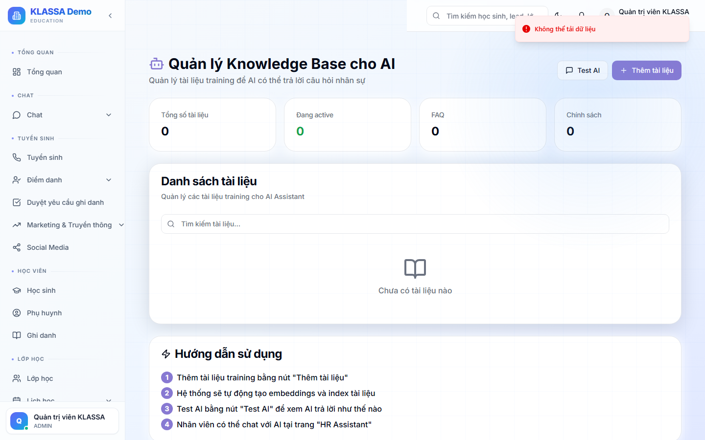

# Cơ sở tri thức (Knowledge base)

## Khái niệm

Upload tài liệu nội bộ vào **Knowledge** để AI tham khảo khi trả lời:

- Sổ tay nhân viên
- Quy trình tuyển sinh
- Kịch bản tư vấn
- Tài liệu giảng dạy
- Câu hỏi thường gặp của phụ huynh

AI sẽ trả lời "dựa trên tài liệu trung tâm" thay vì kiến thức chung chung.

## Truy cập

Menu trái → **AI Hub → Knowledge** (hoặc **/ai-hub/knowledge**).

## Upload tài liệu

- Hỗ trợ định dạng: PDF, Word, Excel, TXT, Markdown
- Tối đa 50MB / file
- Upload nhiều file cùng lúc
- AI tự index trong vài phút

## Quản lý

- Phân thư mục (vd "Quy trình", "Marketing", "Đào tạo GV")
- Gán nhãn (tag) để lọc
- Cập nhật / xoá file

## Phạm vi sử dụng

- **AI Chat** dùng Knowledge khi user hỏi
- **Trợ lý HR** dùng khi soạn văn bản nội bộ
- **AI Insights** tham khảo khi sinh báo cáo

## Lưu ý

- **Dữ liệu được gửi cho nhà cung cấp AI** khi sinh embedding → đảm bảo nhà cung cấp có cam kết bảo mật.
- **Cập nhật thường xuyên** — tài liệu cũ làm AI trả lời sai.

## Câu hỏi thường gặp

**Có giới hạn dung lượng không?**
Free: 100MB. Plus: 1GB. Enterprise: không giới hạn.

**Tôi có thể chia sẻ knowledge với trung tâm khác không?**
Knowledge là dữ liệu nội bộ, không chia sẻ ra ngoài.
