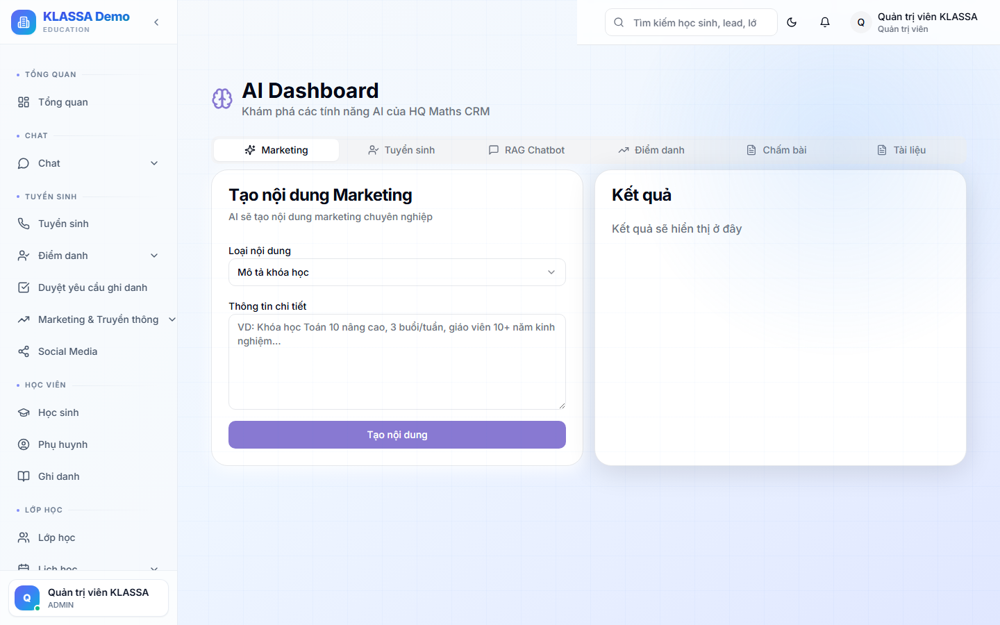

# Tạo media bằng AI

## Khái niệm

Sinh ảnh / video / âm thanh bằng AI:

- Ảnh minh hoạ cho bài đăng MXH
- Avatar cho lớp / khoá học
- Banner quảng cáo
- Logo concept

## Truy cập

Menu trái → **AI Hub → Media** (hoặc **/ai-hub/media**).

## Cách dùng

### Sinh ảnh

1. Gõ mô tả bằng tiếng Việt hoặc tiếng Anh ("Banner lớp Toán THCS, không khí vui tươi, màu cam")
2. Chọn kích thước (vuông / dọc / ngang)
3. Bấm "Sinh" → đợi 5-15 giây → ra 4 ảnh
4. Tải ảnh muốn dùng

### Sinh video ngắn

Tương tự nhưng tốn thời gian + chi phí hơn (15-60 giây).

### Sinh giọng đọc (voice)

- Nhập đoạn text
- Chọn giọng (nam / nữ, vùng miền)
- Sinh file MP3

## Lưu ý

- **Chi phí**: theo lượt sinh. Ảnh ~500đ - 3000đ / ảnh. Video đắt hơn.
- **Quyền sử dụng**: ảnh AI sinh **không có bản quyền** thuộc về trung tâm — có thể dùng thương mại. Nhưng không nên dùng cho mục đích quan trọng (logo chính thức) vì có thể trùng với người khác.
- **Bản quyền**: tránh prompt liên quan đến nhân vật / thương hiệu có bản quyền.

## Câu hỏi thường gặp

**Có thể dùng ảnh AI làm bài đăng quảng cáo Facebook không?**
Được. Nhưng Facebook càng ngày càng kiểm duyệt ảnh AI — đôi khi từ chối quảng cáo. Test trước khi chạy.
