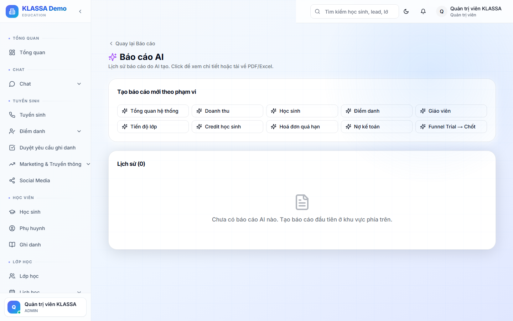

# Báo cáo do AI tổng hợp

## Khái niệm

Thay vì đọc 10 báo cáo riêng, KLASSA dùng AI **tổng hợp toàn cảnh** + đưa ra insight + đề xuất hành động.

## Truy cập

Menu **Báo cáo → AI** (hoặc **/reports/ai**).

## Loại báo cáo AI

### 1. Báo cáo hàng tuần

Tóm tắt tuần qua:
- Điểm nổi bật (doanh thu, HS mới, lớp mới)
- Điểm cần chú ý (HS quá hạn, GV sắp nghỉ)
- 3 hành động đề xuất cho tuần tới

### 2. Báo cáo hàng tháng

Sâu hơn — phân tích xu hướng, so sánh kỳ trước.

### 3. Báo cáo theo yêu cầu

Gõ câu hỏi tự do:
- "Tháng này có gì bất thường về tài chính?"
- "Cơ sở nào hiệu quả nhất quý vừa rồi?"
- "Có dấu hiệu suy giảm chất lượng giảng dạy không?"

AI đọc dữ liệu nội bộ + trả lời chi tiết kèm dẫn chứng.

## Cách AI làm việc

1. AI đọc dữ liệu KLASSA (doanh thu, HS, GV, điểm danh, hoá đơn…)
2. Phát hiện pattern, anomaly
3. Sinh báo cáo bằng tiếng Việt tự nhiên
4. Đề xuất hành động cụ thể

## Lưu ý

- **Cần kết nối AI provider** (xem [Tích hợp AI](../tich-hop/ai-providers.md)) — nếu chưa, tính năng tắt.
- **Tốn tiền AI** theo lượt sinh báo cáo. Tham khảo bảng giá nhà cung cấp.
- **Kiểm tra số liệu** — AI có thể sai vài %, không nên dùng trực tiếp cho báo cáo pháp lý.

## Câu hỏi thường gặp

**AI có thể sinh slide PowerPoint không?**
Hiện tại: sinh PDF có biểu đồ. PowerPoint đang phát triển.

**Tôi muốn báo cáo AI gửi email tự động vào sáng thứ 2, được không?**
Cấu hình trong **Cài đặt → Báo cáo định kỳ** — chọn "Báo cáo AI tuần" + lịch gửi.
