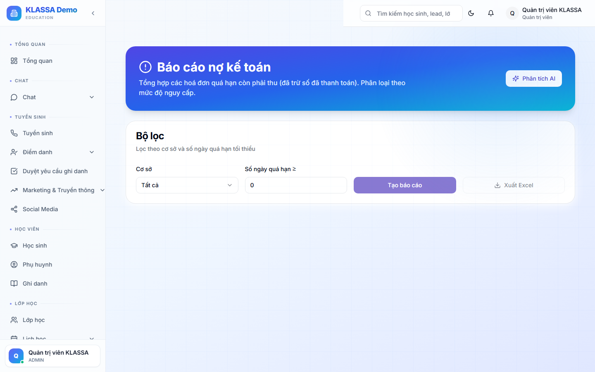

# Báo cáo công nợ

## Khi nào dùng

- Theo dõi học sinh chưa đóng học phí
- Lên danh sách gọi nhắc nợ
- Đánh giá rủi ro thu hồi công nợ

## Truy cập

Menu **Báo cáo → Công nợ** (hoặc **/reports/debt**).

## Nội dung báo cáo

### Tổng quan

- **Tổng nợ phải thu** — toàn trung tâm
- **Theo cơ sở** — cơ sở nào nợ nhiều
- **Theo khoá học**
- **Theo thời hạn**:
  - Còn trong hạn
  - Quá hạn < 7 ngày
  - Quá hạn 7-30 ngày
  - Quá hạn > 30 ngày (rủi ro cao)

### Bảng chi tiết

Mỗi dòng = 1 hoá đơn chưa thanh toán:

- Học sinh + Phụ huynh + SĐT
- Số tiền nợ
- Hạn thanh toán
- Số ngày quá hạn
- Lần nhắc gần nhất

## Hành động nhanh

Từ mỗi dòng:

- 💬 **Nhắn Zalo nhắc nợ** — gửi tự động qua mẫu sẵn
- ☎️ **Gọi điện** — qua app Zalo / điện thoại
- ✉️ **Gửi email nhắc nợ**
- 📝 **Ghi chú** — ghi lý do nợ, cam kết của phụ huynh

## Xuất Excel

Chia nhân viên gọi nợ theo cơ sở / khu vực.

## Lưu ý

- **Nợ > 30 ngày** cần đối thoại trực tiếp, không chỉ nhắn tin.
- **Một số trường hợp phải có chính sách** giảm/miễn nợ (gia đình khó khăn) — Quản lý quyết định.

## Câu hỏi thường gặp

**Tự động gửi nhắc nợ, cấu hình ở đâu?**
[Cài đặt tài chính](../hoc-phi/cai-dat.md) → bật "Tự động gửi nhắc nợ" + chọn ngày trước/sau hạn.
