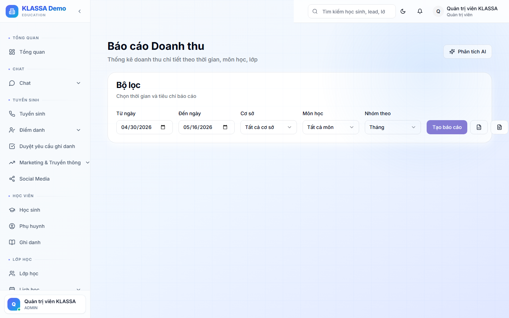

# Báo cáo doanh thu

## Khi nào dùng

- Báo cáo tháng / quý / năm cho Chủ trung tâm
- So sánh doanh thu giữa các cơ sở
- Phân tích xu hướng theo mùa

## Truy cập

Menu **Báo cáo → Doanh thu** (hoặc **/reports/revenue**).

## Các góc nhìn

### 1. Doanh thu theo thời gian

Biểu đồ đường — doanh thu theo ngày / tuần / tháng / năm.

### 2. Doanh thu theo cơ sở

Cơ sở nào đóng góp bao nhiêu %.

### 3. Doanh thu theo khoá học

Khoá Toán đóng bao nhiêu, Tiếng Anh bao nhiêu — phục vụ quyết định mở thêm khoá nào.

### 4. Doanh thu theo nguồn Lead

Khách từ Facebook Ads / Zalo / khách giới thiệu — đo ROI quảng cáo.

### 5. Doanh thu cộng dồn

So với mục tiêu năm — đang đạt bao nhiêu %.

## Chỉ số quan trọng

- **Doanh thu thuần** = Thu - Hoàn tiền
- **Doanh thu/học sinh** (ARPU) — TB mỗi HS đóng bao nhiêu
- **MRR** (doanh thu định kỳ tháng) — chỉ số sức khoẻ kinh doanh

## Xuất file

- Excel chi tiết
- PDF tóm tắt cho cuộc họp

## Câu hỏi thường gặp

**So sánh với năm ngoái, có không?**
Có. Bộ lọc thời gian → "So sánh với cùng kỳ năm trước" → biểu đồ overlay.
