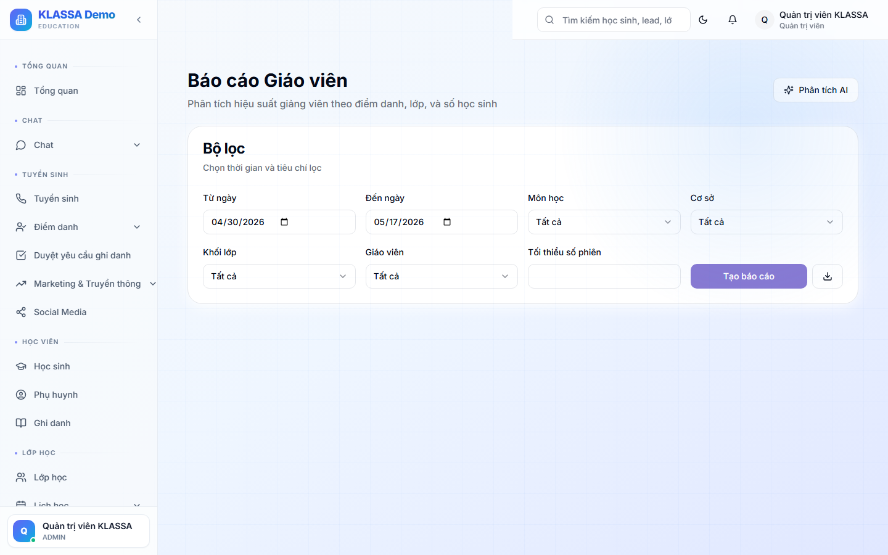

# Báo cáo theo giáo viên

## Khi nào dùng

- Đánh giá hiệu quả giảng dạy của từng GV
- So sánh giữa các GV cùng môn
- Quyết định tăng lương / thưởng cuối quý

## Truy cập

Menu **Báo cáo → Theo giáo viên** (hoặc **/reports/teachers**).

## Các chỉ số đo

### Năng suất

- Số lớp đang dạy
- Tổng số buổi đã dạy / tháng
- Tổng số HS phụ trách

### Chất lượng

- Tỷ lệ chuyên cần TB lớp dạy
- Điểm trung bình HS lớp dạy
- Đánh giá phụ huynh (sao + nhận xét)
- Tỷ lệ HS lên lớp / kết thúc khoá

### Doanh thu

- Doanh thu từ lớp GV dạy (giúp đánh giá nếu GV hưởng theo doanh thu)
- ROI: doanh thu / lương GV

## So sánh

Có thể so sánh:
- GV vs GV (cùng môn)
- GV vs trung bình toàn trung tâm
- GV theo tháng (xem có cải thiện không)

## Cảnh báo

- GV có tỷ lệ chuyên cần lớp dạy thấp → có thể HS không thích cách dạy
- GV có HS kết quả kém → cần đào tạo lại GV?
- Đánh giá phụ huynh giảm → có vấn đề?

## Lưu ý

- **Không quy chụp đơn giản** — số liệu kém có thể do HS đầu vào yếu, không phải lỗi GV.
- **Dùng để đối thoại** chứ không phải để chấm điểm cứng.

## Câu hỏi thường gặp

**Tôi muốn GV thấy báo cáo của bản thân, được không?**
Có. Trong Cài đặt → Cho phép GV xem báo cáo cá nhân — GV chỉ thấy số của mình.
