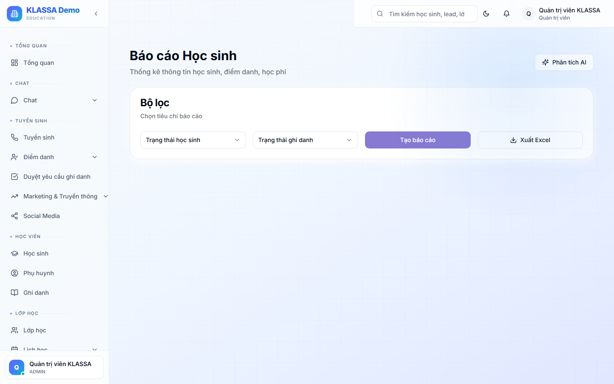

# Báo cáo theo học sinh

## Khi nào dùng

- Tổng hợp thông tin 1 học sinh để báo phụ huynh
- Đánh giá tiến bộ sau 1 khoá
- Trao đổi với phụ huynh khi có vấn đề

## Truy cập

Menu **Báo cáo → Theo học sinh** (hoặc **/reports/students**).

## Nội dung báo cáo

### Tổng quan

- Thông tin cá nhân
- Lớp đang học + lịch sử
- Tổng buổi đã học / Tổng buổi đăng ký
- Tỷ lệ chuyên cần
- Điểm trung bình tích luỹ

### Học tập

- Kết quả các bài đánh giá
- Tiến bộ qua thời gian (biểu đồ)
- Điểm mạnh / điểm yếu

### Tài chính

- Tổng học phí đã đóng
- Còn nợ (nếu có)
- Lịch sử thanh toán

### Tương tác

- Tin nhắn gần đây giữa trung tâm và phụ huynh
- Phản hồi từ phụ huynh
- Đánh giá / nhận xét của giáo viên

## Xuất PDF cho phụ huynh

Báo cáo có sẵn 3 mẫu:
- **Tóm tắt** — 1 trang
- **Chi tiết** — 3-4 trang
- **Đầy đủ** — 6-10 trang (cuối kỳ)

Mẫu có sẵn logo + thương hiệu trung tâm.

## Tự động gửi

Cấu hình trong Cài đặt → Báo cáo định kỳ:
- Hàng tháng — báo cáo tóm tắt
- Hàng quý — báo cáo chi tiết
- Cuối khoá — báo cáo đầy đủ

## Lưu ý

- **Bảo mật**: chỉ trung tâm + phụ huynh có quyền xem báo cáo của 1 HS.
- **Phụ huynh xem** trong Cổng Phụ huynh → tab Học tập.

## Câu hỏi thường gặp

**Phụ huynh nói không nhận được báo cáo tự động, kiểm tra ở đâu?**
Trong chi tiết HS → tab Tin nhắn → tìm lịch sử báo cáo đã gửi (thời gian, kênh, có đọc chưa).
