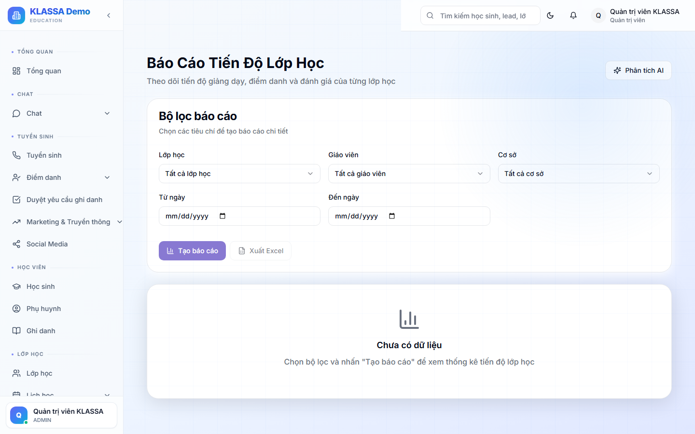

# Báo cáo tiến độ học

## Khi nào dùng

- Phụ huynh hỏi tình hình con
- Cuối kỳ đánh giá xem khoá đã đi đến đâu so với kế hoạch
- Theo dõi lớp nào tiến độ chậm hơn lớp khác

## Truy cập

Menu **Báo cáo → Tiến độ** (hoặc **/reports/progress**).

## Các chỉ số

### Theo học sinh

- Số buổi đã học / Tổng buổi khoá
- % Hoàn thành
- Điểm trung bình tích luỹ
- Tiến bộ so với đầu khoá

### Theo lớp

- TB lớp đang ở % nào của khoá
- Có lớp nào tụt hậu so với lớp khác cùng khoá?
- Dự đoán ngày kết thúc khoá (nếu giữ tốc độ hiện tại)

### Theo khoá học (chương trình)

- Bao nhiêu bài giảng / chương đã dạy
- Tốc độ giảng dạy trung bình
- So sánh giữa các giáo viên (GV nào dạy nhanh, GV nào chậm)

## Cảnh báo

- Lớp chậm > 20% so với kế hoạch
- Học sinh có < 50% chuyên cần (khó theo kịp)
- Khoá sắp kết thúc nhưng chưa dạy hết chương

## Xuất file

- PDF cho phụ huynh (chi tiết HS)
- Excel cho hội đồng chuyên môn

## Lưu ý

- Chỉ chính xác nếu **giáo viên ghi nhận** chương đã dạy sau từng buổi (trong chi tiết buổi → tab Nội dung).

## Câu hỏi thường gặp

**Tiến độ "chậm" có phải là xấu?**
Không nhất thiết. Có thể GV dạy kỹ hơn — đợi đến kết quả cuối khoá mới đánh giá được.
