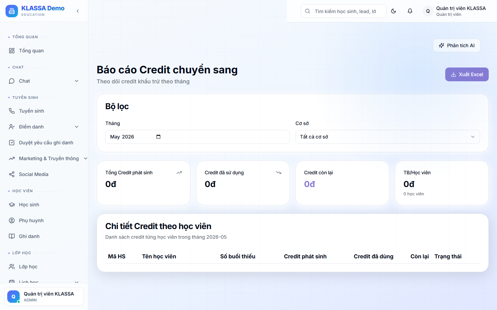

# Báo cáo tín chỉ học sinh

## Khái niệm

**Tín chỉ học sinh** = số buổi học mà phụ huynh đã đóng tiền nhưng học sinh chưa học hết. Phục vụ:

- Báo cáo "nợ buổi" của trung tâm với phụ huynh
- Tính giá trị nghĩa vụ (deferred revenue)
- Cảnh báo học sinh sắp hết buổi cần đóng tiếp

## Truy cập

Menu **Báo cáo → Tín chỉ** (hoặc **/reports/credit**).

## Nội dung

### Tổng quan

- Tổng số buổi đã bán (toàn trung tâm)
- Tổng số buổi đã dùng (đã chấm điểm danh "có mặt" hoặc "đi muộn")
- **Tổng buổi còn lại** = bán - dùng
- Giá trị tiền tương đương (số buổi × đơn giá)

### Theo học sinh

Bảng:
- Học sinh
- Khoá / lớp
- Buổi đã đóng
- Buổi đã học
- Buổi còn lại
- Hạn dùng (nếu có)

### Cảnh báo

- Học sinh sắp hết buổi (≤ 3 buổi) — nhắc đóng tiếp
- Học sinh có nhiều buổi (> 20 buổi còn) — kiểm tra có học không
- Tín chỉ sắp hết hạn — chính sách bảo lưu

## Hành động

Từ danh sách:
- 💬 Nhắn Zalo nhắc đóng tiếp
- 📄 Tạo hoá đơn gia hạn

## Lưu ý

- **Tín chỉ là nghĩa vụ kế toán** — trung tâm phải dạy đủ số buổi đã bán.
- **Quy đổi tiền tệ**: phục vụ báo cáo cuối năm cho kế toán thuế.

## Câu hỏi thường gặp

**Học sinh nghỉ học, tín chỉ còn lại xử lý sao?**
Theo chính sách hoàn (Cài đặt tài chính): hoàn tiền hoặc bảo lưu cho khoá sau.
