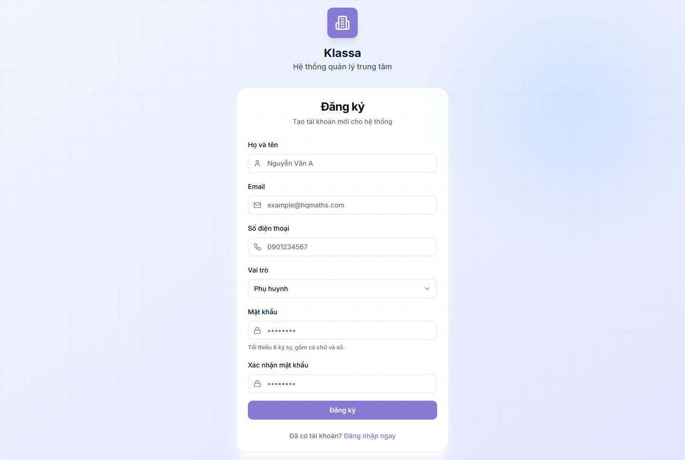

# Đăng ký tài khoản

## Khi nào dùng

Nhân viên mới (hoặc phụ huynh) **tự đăng ký tài khoản** từ trang công khai, sau đó chờ Chủ trung tâm / Quản lý **duyệt** mới đăng nhập được.

> Đây là cách tài khoản **tự đăng ký**. Ngoài ra Chủ trung tâm có thể **tạo thẳng tài khoản** cho nhân viên (kích hoạt ngay, không cần duyệt) — xem [Quản lý người dùng](../cai-dat/nguoi-dung.md).

## Cách đăng ký

### Bước 1 — Mở trang đăng ký

Tại trang [đăng nhập](dang-nhap.md), bấm dòng **"Chưa có tài khoản? Đăng ký ngay"** → mở trang `/auth/signup`.

### Bước 2 — Điền thông tin

- **Họ và tên** \*
- **Email** \* (dùng để đăng nhập, không trùng email đã có)
- **Số điện thoại** (tuỳ chọn)
- **Vai trò** \* — chọn đúng vị trí:
  - Phụ huynh
  - Giáo viên
  - Trợ giảng
  - Tư vấn tuyển sinh (lễ tân)
  - Nhân viên văn phòng
- **Mật khẩu** \* (tối thiểu 8 ký tự, có cả chữ và số)
- **Xác nhận mật khẩu** \*

Bấm **"Đăng ký"**.

### Bước 3 — Chờ duyệt

Sau khi đăng ký:
- Tài khoản ở trạng thái **"Chờ duyệt"**, **chưa đăng nhập được**.
- Chủ trung tâm / Quản lý nhận thông báo có tài khoản mới chờ duyệt.
- Khi được duyệt, anh chị nhận thông báo và đăng nhập bình thường.

## Lưu ý

- **Chọn đúng vai trò** khi đăng ký — duyệt xong khó đổi (phải nhờ admin).
- **Tài khoản nhân viên** (giáo viên, lễ tân, kế toán…): khi được duyệt, hệ thống **tự tạo hồ sơ nhân sự** để dùng [Cổng nhân viên](../cong-nhan-vien/gioi-thieu.md).
- Nếu đăng ký nhầm / không được duyệt sau lâu → liên hệ trực tiếp Chủ trung tâm.

## Câu hỏi thường gặp

**Đăng ký xong sao không đăng nhập được?**
Tài khoản tự đăng ký phải chờ Chủ trung tâm / Quản lý duyệt. Liên hệ trung tâm để được duyệt nhanh.

**Tôi là chủ trung tâm, muốn tạo tài khoản cho nhân viên mà không cần họ tự đăng ký?**
Vào [Quản lý người dùng](../cai-dat/nguoi-dung.md) → "Tạo người dùng" — tài khoản kích hoạt ngay.

**Phụ huynh có cần tự đăng ký không?**
Thường KHÔNG. Khi lễ tân [tạo hồ sơ học sinh](../hoc-sinh/tao-moi.md), tài khoản phụ huynh được tạo tự động (mật khẩu mặc định `12345678`). Tự đăng ký chỉ dùng khi phụ huynh muốn tự tạo trước.
