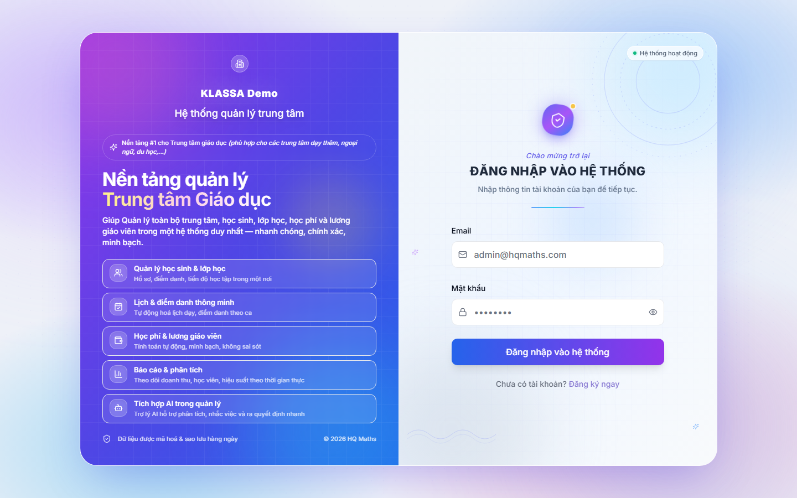

# Đăng nhập vào phần mềm

## Khi nào dùng

Đây là bước đầu tiên mỗi khi anh chị mở phần mềm để bắt đầu công việc. Mỗi nhân viên trong trung tâm sẽ có một tài khoản riêng, và phần mềm sẽ hiển thị các chức năng tương ứng với vai trò của tài khoản đó.

## Các bước thao tác

### Bước 1 — Mở trang đăng nhập

Mở trình duyệt (Chrome, Edge, Cốc Cốc, Safari đều dùng được) rồi gõ địa chỉ phần mềm của trung tâm anh chị. Ví dụ:

```
https://tên-trung-tâm.klassa.vn
```

Phần mềm sẽ tự động đưa anh chị đến trang đăng nhập.



### Bước 2 — Nhập tài khoản

Phần mềm yêu cầu hai thông tin:

- **Email**: chính là email mà quản trị viên đã tạo cho anh chị, ví dụ `consultant@trungtam.vn`
- **Mật khẩu**: mật khẩu khởi tạo do quản trị viên cung cấp (lần đầu đăng nhập, phần mềm sẽ yêu cầu anh chị đổi sang mật khẩu của riêng mình)

Sau đó bấm nút **Đăng nhập**.

### Bước 3 — Vào màn hình làm việc

Nếu thông tin đúng, phần mềm sẽ chuyển sang **Bảng tổng quan** — đây là màn hình chính để anh chị bắt đầu mọi công việc trong ngày.

## Lưu ý

- **Quên mật khẩu?** Bấm vào dòng "Quên mật khẩu?" ngay dưới ô đăng nhập, hệ thống sẽ gửi link đặt lại mật khẩu về email của anh chị.
- **Sai mật khẩu nhiều lần** sẽ bị khoá tạm thời 15 phút để bảo vệ tài khoản. Nếu bị khoá, hãy đợi hoặc liên hệ quản trị viên trung tâm.
- **Không chia sẻ mật khẩu** với người khác. Mỗi hành động trong phần mềm đều được ghi lại theo tài khoản đăng nhập, nên việc chia sẻ có thể gây hiểu nhầm trách nhiệm.

## Câu hỏi thường gặp

**Chưa có tài khoản thì làm sao?**
Dưới ô đăng nhập có dòng **"Chưa có tài khoản? Đăng ký ngay"** → xem [Đăng ký tài khoản](dang-ky.md). Hoặc nhờ Chủ trung tâm tạo sẵn tài khoản trong [Quản lý người dùng](../cai-dat/nguoi-dung.md).

**Tôi có thể đăng nhập trên điện thoại không?**
Có. Phần mềm hoạt động tốt trên trình duyệt điện thoại. Anh chị mở Chrome/Safari trên điện thoại và truy cập cùng địa chỉ.

**Tôi có thể đăng nhập cùng lúc trên nhiều thiết bị không?**
Được. Cùng một tài khoản có thể mở trên máy tính và điện thoại cùng lúc. Tuy nhiên mọi thao tác đều được đồng bộ ngay, nên cẩn thận khi nhiều người dùng chung một tài khoản.

**Quản trị viên là ai?**
Là người đầu tiên đăng ký phần mềm cho trung tâm — thường là chủ trung tâm hoặc người được uỷ quyền. Quản trị viên có quyền tạo và quản lý tài khoản cho các nhân viên khác.
