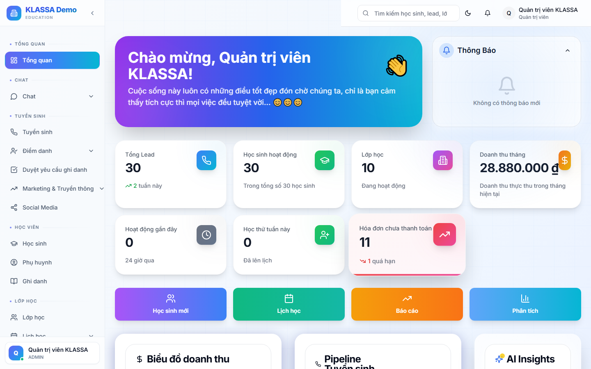

# Bảng tổng quan (Dashboard)

## Khi nào dùng

Bảng tổng quan là màn hình đầu tiên anh chị thấy sau khi đăng nhập. Đây là nơi nhìn nhanh toàn cảnh hoạt động của trung tâm: bao nhiêu học sinh đang học, doanh thu tháng này, các buổi học hôm nay, công việc cần làm.

Anh chị có thể vào lại bảng tổng quan bất cứ lúc nào bằng cách bấm vào **logo trung tâm** ở góc trên bên trái màn hình.

## Các phần trên bảng tổng quan

### 1. Khối số liệu nhanh

Bốn ô vuông phía trên cùng cho biết các con số quan trọng nhất:

- **Số học sinh đang học** — tính tổng các bạn còn đang theo lớp, không tính đã nghỉ
- **Doanh thu tháng này** — tổng học phí đã thu được trong tháng hiện tại
- **Lead chưa xử lý** — số khách hàng quan tâm chưa được tư vấn viên liên hệ
- **Buổi học hôm nay** — tổng số ca học diễn ra trong ngày

### 2. Lịch ngày hôm nay

Phần giữa hiển thị danh sách buổi học của ngày hôm nay, sắp xếp theo giờ. Mỗi buổi có:

- Tên lớp + môn học
- Phòng học (nếu trung tâm dùng nhiều phòng)
- Giáo viên phụ trách
- Tình trạng điểm danh (chưa chấm / đã chấm)

Bấm vào từng buổi để vào thẳng màn hình điểm danh.

### 3. Biểu đồ xu hướng

Bên dưới là biểu đồ đường thể hiện xu hướng 30 ngày gần nhất:

- Số học sinh mới mỗi ngày
- Doanh thu mỗi ngày
- Số buổi học mỗi ngày

Anh chị có thể chọn xem 7 ngày, 30 ngày hoặc 90 ngày bằng nút lọc ở góc phải biểu đồ.

### 4. Việc cần làm

Phía dưới cùng là danh sách công việc mà phần mềm gợi ý anh chị xử lý:

- Lead chưa gọi quá 2 ngày
- Học sinh sắp hết hạn học phí
- Buổi học chưa chấm điểm danh
- Hoá đơn chưa gửi

Bấm vào từng dòng để vào ngay màn hình tương ứng.

## Lưu ý

- **Mỗi vai trò thấy bảng tổng quan khác nhau**. Ví dụ giáo viên chỉ thấy lớp của mình, lễ tân thấy phễu tuyển sinh, chủ trung tâm thấy tổng thể. Đây là tính năng có chủ ý để không hiển thị thông tin nhạy cảm cho người không cần biết.
- **Số liệu được cập nhật theo thời gian thực**. Nếu một đồng nghiệp vừa tạo hoá đơn, doanh thu trên bảng tổng quan sẽ tăng ngay sau khi anh chị làm mới trang (F5).

## Câu hỏi thường gặp

**Tôi muốn xem số liệu của một cơ sở cụ thể, làm sao?**
Nếu trung tâm có nhiều cơ sở, ở góc trên bảng tổng quan có nút chọn cơ sở. Mặc định hiển thị tổng toàn trung tâm; chọn một cơ sở cụ thể để chỉ xem số của cơ sở đó.

**Tôi muốn xem dữ liệu của tháng trước, làm sao?**
Bấm vào bộ lọc thời gian ở góc phải trên cùng, chọn "Tháng trước" hoặc tự chọn khoảng ngày tuỳ ý.

**Tôi có thể xuất bảng tổng quan ra Excel để báo cáo sếp không?**
Có. Mỗi khối số liệu đều có nút "Xuất Excel" ở góc trên bên phải. Xem chi tiết trong mục **Báo cáo**.
