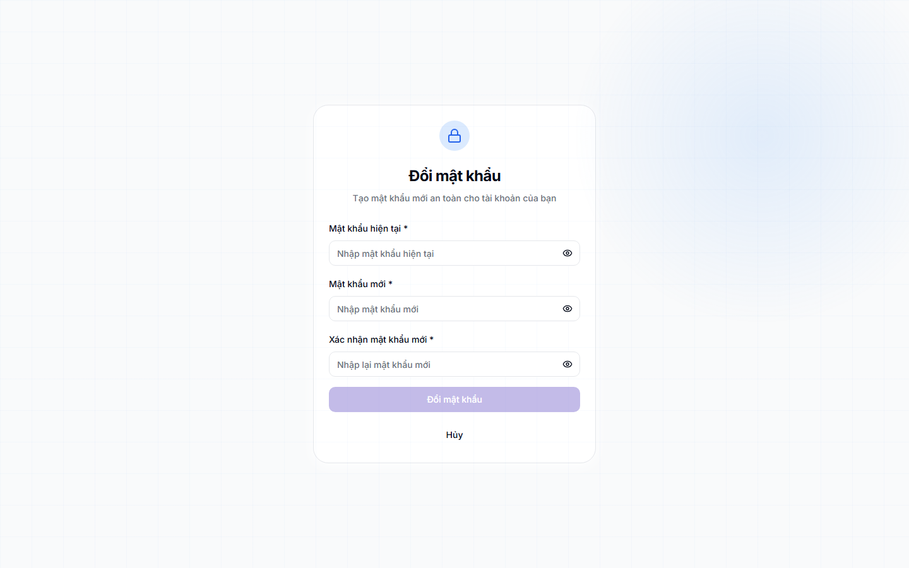
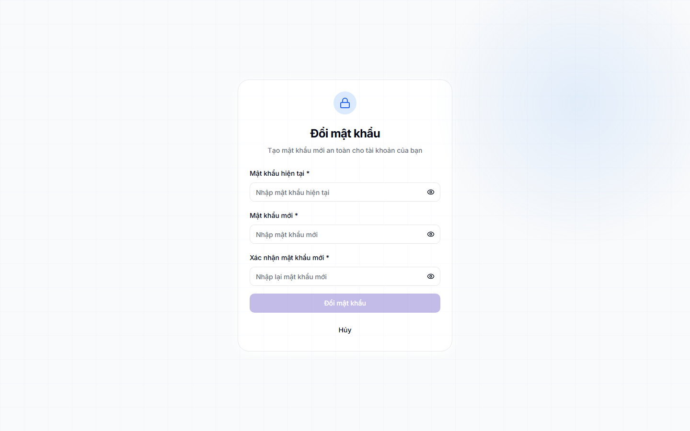

# Đổi mật khẩu

## Khi nào dùng

- **Lần đầu đăng nhập**: phần mềm sẽ tự yêu cầu anh chị đổi mật khẩu khởi tạo sang mật khẩu của riêng mình.
- **Định kỳ**: nên đổi mật khẩu 3-6 tháng một lần để bảo mật.
- **Khi nghi ngờ tài khoản bị lộ**: ví dụ vô tình đăng nhập trên máy lạ, hoặc bị ai đó nhìn thấy khi gõ mật khẩu.

## Các bước thao tác

### Bước 1 — Mở trang đổi mật khẩu

Bấm vào **ảnh đại diện** ở góc trên bên phải màn hình, chọn **"Đổi mật khẩu"**.

### Bước 2 — Nhập thông tin

Phần mềm yêu cầu 3 thông tin:

- **Mật khẩu hiện tại** — mật khẩu anh chị đang dùng để đăng nhập
- **Mật khẩu mới** — mật khẩu anh chị muốn đổi sang
- **Nhập lại mật khẩu mới** — gõ lại y hệt để chắc chắn không gõ nhầm

### Bước 3 — Bấm "Đổi mật khẩu"

Nếu mọi thông tin hợp lệ, phần mềm sẽ báo thành công. Lần đăng nhập tiếp theo anh chị dùng mật khẩu mới.

## Yêu cầu mật khẩu

Mật khẩu mới phải đạt:

- **Tối thiểu 8 ký tự**
- **Có ít nhất 1 chữ hoa** (A-Z)
- **Có ít nhất 1 chữ thường** (a-z)
- **Có ít nhất 1 số** (0-9)

Khuyến nghị: nên có thêm ký tự đặc biệt (`@`, `#`, `!`...) để mật khẩu mạnh hơn.

**Ví dụ mật khẩu tốt**: `Klassa@2026`, `TrungTam#1234`, `Hocsinh!95`

**Ví dụ mật khẩu yếu (không nên dùng)**: `12345678`, `password`, `abcdefgh`, ngày sinh, số điện thoại.

## Lưu ý

- **Không dùng lại mật khẩu cũ**: phần mềm cho phép, nhưng không an toàn.
- **Không chia sẻ mật khẩu mới** với người khác, kể cả đồng nghiệp. Mỗi người nên có tài khoản riêng.
- **Nhớ mật khẩu mới ngay**: tránh ghi mật khẩu ra giấy dán lên máy tính. Nếu sợ quên, dùng phần mềm quản lý mật khẩu (Bitwarden, 1Password) hoặc trình duyệt lưu giúp.

## Câu hỏi thường gặp

**Tôi quên mật khẩu cũ, làm sao đổi?**
Nếu chưa đăng nhập được, dùng chức năng **"Quên mật khẩu?"** ở trang đăng nhập — phần mềm gửi link đặt lại qua email. Nếu vẫn không vào được email, liên hệ quản trị viên trung tâm để được hỗ trợ.

**Phần mềm có nhớ mật khẩu cho tôi không?**
Phần mềm không nhớ thay anh chị, nhưng trình duyệt sẽ hỏi có muốn lưu không. Bấm "Lưu" để lần sau khỏi gõ. Tuy nhiên không nên lưu mật khẩu trên máy tính chung.

**Đổi mật khẩu có làm mất dữ liệu công việc đang làm không?**
Không. Đổi mật khẩu chỉ ảnh hưởng cách đăng nhập, không liên quan đến dữ liệu học sinh, lớp học, hay bất kỳ thông tin nào trong phần mềm.
