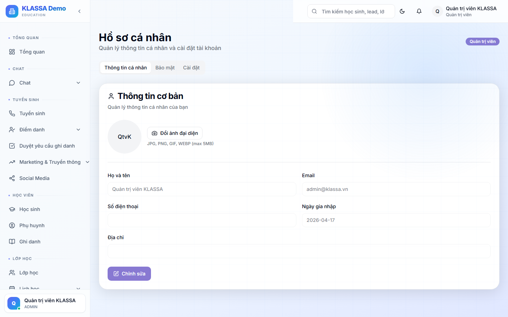

# Hồ sơ cá nhân

## Khi nào dùng

- Cập nhật ảnh đại diện để đồng nghiệp nhận diện trong chat
- Đổi số điện thoại / email cá nhân
- Bật / tắt thông báo qua email
- Xem lịch sử hoạt động của chính mình

## Các bước thao tác

### Mở trang Hồ sơ

Bấm vào **ảnh đại diện** ở góc trên bên phải màn hình → chọn **"Hồ sơ cá nhân"**.

### Trang hồ sơ có gì?

#### 1. Khối ảnh đại diện

Bấm vào ảnh để tải ảnh mới từ máy tính. Ảnh nên là hình vuông, dung lượng dưới 2MB. Phần mềm sẽ tự cắt và lưu.

#### 2. Thông tin cơ bản

- **Họ tên** — tên hiển thị trên toàn phần mềm (tin nhắn, lịch dạy, báo cáo…)
- **Email** — vẫn là email đăng nhập, không đổi được ở đây (cần Chủ trung tâm đổi giúp)
- **Số điện thoại** — nên điền để đồng nghiệp gọi nhanh
- **Vai trò** — chỉ xem, không tự đổi được

#### 3. Cài đặt thông báo

- Nhận email khi có Lead mới?
- Nhận email khi học sinh đóng học phí?
- Nhận email khi sắp đến giờ dạy?

Tắt bớt nếu thấy email quá nhiều.

#### 4. Đổi mật khẩu

Có liên kết nhanh sang trang [Đổi mật khẩu](doi-mat-khau.md).

#### 5. Phiên đăng nhập

Danh sách các thiết bị đã đăng nhập tài khoản của anh chị. Bấm **"Đăng xuất"** ở từng thiết bị nếu thấy có máy lạ.

## Lưu ý

- **Đổi tên hiển thị**: ảnh hưởng đến mọi nơi trong phần mềm — phụ huynh chat sẽ thấy tên mới luôn.
- **Tắt thông báo email**: vẫn nhận thông báo trong phần mềm, chỉ là không gửi qua email.

## Câu hỏi thường gặp

**Tôi đổi ảnh nhưng người khác vẫn thấy ảnh cũ?**
Trình duyệt của họ đang nhớ ảnh cũ. Họ cần làm mới trang (F5) hoặc đợi vài phút.

**Tôi muốn đổi email đăng nhập, làm sao?**
Email là khoá định danh tài khoản, không tự đổi được. Liên hệ Chủ trung tâm để được hỗ trợ.
