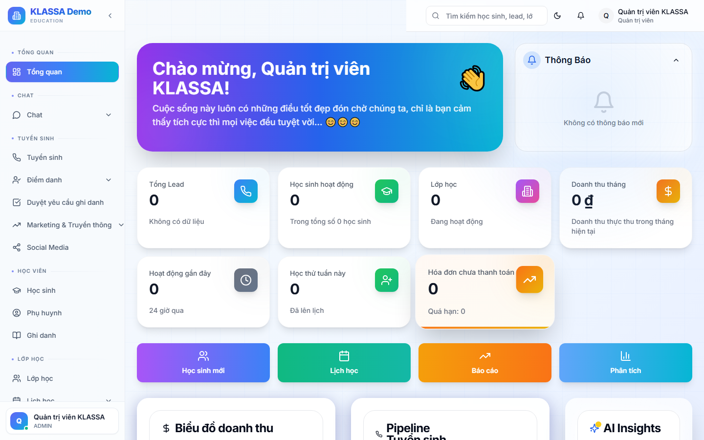

# Menu trái — cách dùng

## Khái niệm

Menu bên trái là **mục lục chính** của toàn phần mềm. Mọi chức năng đều được truy cập từ đây.

## Cấu trúc menu

Menu được chia thành **nhóm chức năng**:

### Nhóm trên — Hoạt động hàng ngày
- **Bảng tổng quan** — màn hình chính
- **Tuyển sinh** — Lead, phễu, lịch học thử
- **Học sinh** — danh sách, hồ sơ
- **Lớp học** — lớp, ghi danh, lịch dạy
- **Điểm danh** — chấm điểm danh

### Nhóm giữa — Tài chính & Nhân sự
- **Học phí & Hoá đơn**
- **Nhân sự** — nhân viên, lương, chấm công
- **Báo cáo** — toàn bộ báo cáo

### Nhóm dưới — Truyền thông & Mở rộng
- **Tin nhắn** — Zalo, email, Facebook
- **AI Hub** — trợ lý AI
- **Tự động hoá** — workflow
- **Marketing** — mạng xã hội, pixel
- **Plugin** — tính năng mở rộng

### Nhóm cuối — Cài đặt
- **Tích hợp** — kết nối bên ngoài
- **Cài đặt** — admin

## Mẹo sử dụng

### Thu gọn menu

Bấm nút **mũi tên ◀** ở góc dưới menu để thu gọn thành biểu tượng nhỏ — có thêm không gian cho nội dung chính.

### Tìm nhanh chức năng

Bấm phím **Ctrl + K** (hoặc **⌘ + K** trên Mac) để mở ô tìm kiếm nhanh — gõ tên chức năng để nhảy đến ngay không cần bấm menu.

### Menu theo vai trò

Mỗi vai trò người dùng thấy menu **khác nhau**:

- **Giáo viên** chỉ thấy: Tổng quan, Lớp học, Điểm danh, Lương cá nhân, Tin nhắn
- **Phụ huynh** không thấy menu này, dùng riêng **Cổng Phụ huynh**
- **Lễ tân** không thấy: Nhân sự, Báo cáo doanh thu, Cài đặt admin

## Câu hỏi thường gặp

**Tôi không thấy mục "Nhân sự" trong menu, tại sao?**
Tài khoản của anh chị không có quyền truy cập module Nhân sự. Liên hệ Chủ trung tâm nếu cần quyền.

**Có thể tự sắp xếp lại menu không?**
Chủ trung tâm có thể tuỳ chỉnh thứ tự và ẩn / hiện các mục trong **Cài đặt → Tuỳ chỉnh menu**. Áp dụng cho toàn trung tâm, không phải cho riêng từng người.

**Menu hiển thị bằng tiếng Việt, đổi sang tiếng Anh được không?**
Hiện tại phần mềm chỉ có tiếng Việt. Phiên bản đa ngôn ngữ đang được phát triển.
