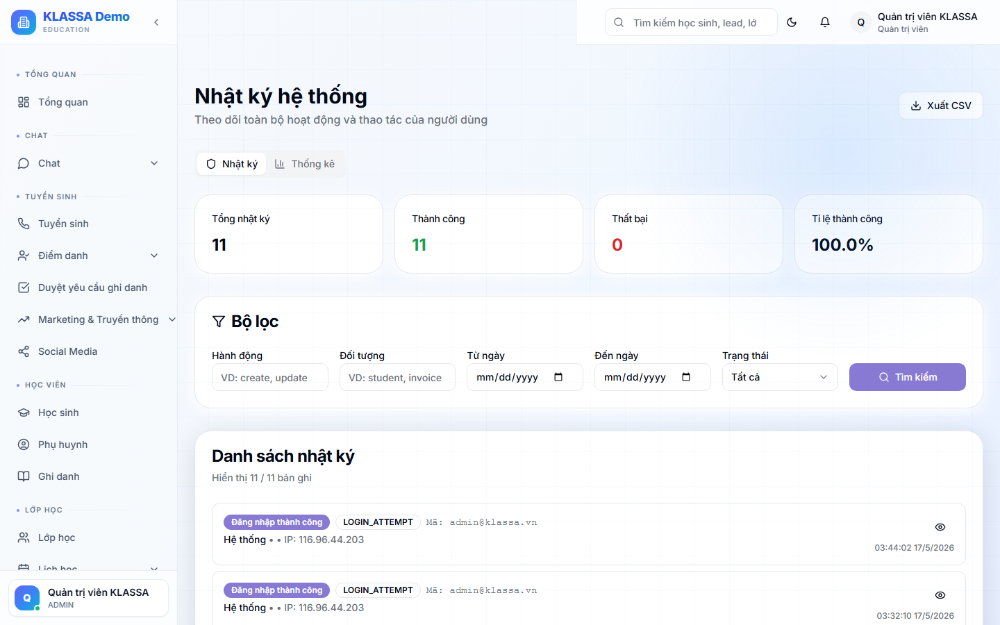

# Nhật ký truy cập (Audit log)

## Khái niệm

KLASSA ghi lại **mọi hành động** trong hệ thống — phục vụ truy vết khi có sự cố hoặc nghi vấn.

## Truy cập

Menu trái → **Cài đặt → Audit log** (hoặc **/admin/audit-logs**). Chỉ Chủ trung tâm xem được.

## Loại sự kiện được ghi

- **Đăng nhập / Đăng xuất**
- **Tạo / Sửa / Xoá** (mọi dữ liệu)
- **Đổi vai trò / Khoá tài khoản**
- **Truy cập dữ liệu nhạy cảm** (xem lương, xem hồ sơ HS)
- **Xuất file** (Excel, PDF)
- **Cấu hình hệ thống thay đổi**

## Thông tin lưu

- Thời gian (chính xác đến giây)
- User thực hiện
- Hành động
- Đối tượng bị ảnh hưởng
- IP đăng nhập
- User Agent (trình duyệt + OS)
- Giá trị trước - sau (cho sửa)

## Bộ lọc

- Theo user
- Theo loại sự kiện
- Theo thời gian
- Tìm kiếm tự do

## Xuất file

Có thể xuất Excel cho cơ quan điều tra / cấp trên / luật sư nếu có tranh chấp.

## Lưu ý

- **Không xoá được** audit log — đảm bảo tính trung thực.
- **Lưu trữ lâu dài** — KLASSA giữ tối thiểu 2 năm. Plugin nâng cao có thể giữ 5-10 năm.

## Câu hỏi thường gặp

**Có thể xem ai đã xoá hoá đơn X cách đây 2 tháng không?**
Có. Lọc theo loại "Xoá hoá đơn" + tên hoá đơn → tìm được.
