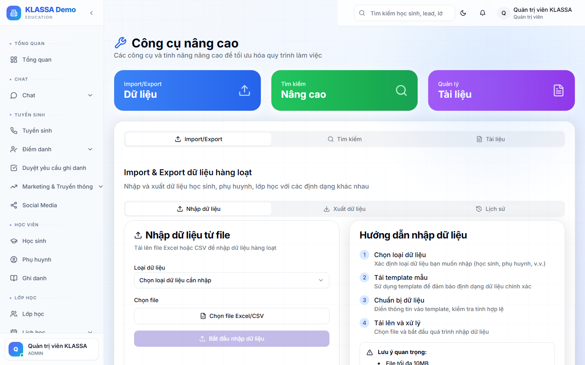

# Công cụ Admin (Tools)

## Khái niệm

Trang **Tools** tập hợp các công cụ nâng cao dành cho Quản lý / Chủ trung tâm — không phải tính năng dùng hàng ngày, mà cho các tác vụ đặc biệt.

## Truy cập

Menu trái → **Cài đặt → Công cụ** (hoặc **/tools**).

## 3 công cụ chính

### 1. Nhập / Xuất dữ liệu hàng loạt (Bulk Data Import/Export)

Phù hợp khi:
- Triển khai trung tâm mới — nhập danh sách HS + phụ huynh từ phần mềm cũ
- Chuyển dữ liệu giữa các cơ sở
- Backup định kỳ

Hỗ trợ định dạng:
- Excel (.xlsx)
- CSV
- JSON (cho tích hợp kỹ thuật)

Cách dùng:
1. Tải **file mẫu** đúng định dạng
2. Điền dữ liệu, không đổi tên cột
3. Tải lên → phần mềm validate
4. Xem trước → bấm "Nhập" → dữ liệu vào hệ thống

Loại dữ liệu hỗ trợ:
- Học sinh + phụ huynh
- Lớp học
- Khoá học
- Hoá đơn cũ
- Nhân viên

### 2. Tìm kiếm nâng cao (Advanced Search)

Tìm xuyên modules với điều kiện phức tạp:

- "Học sinh đang học lớp Toán 9 + đã đóng > 5 triệu + chuyên cần > 90%"
- "Giáo viên cộng tác đã ký hợp đồng + đang dạy lớp đông > 20 HS"
- "Hoá đơn quá hạn + chưa nhắc lần nào"

Lưu được **bộ lọc** để dùng lại.

### 3. Quản lý tài liệu (Document Manager)

Lưu trữ tài liệu nội bộ trung tâm:

- Quy trình / nội quy
- Mẫu hợp đồng
- Tài liệu marketing
- Brand assets (logo, video, ảnh)
- File lưu trữ chung

Phân quyền: ai xem được tài liệu nào, ai sửa được.

## Lưu ý

- **Bulk import có thể trùng dữ liệu** — luôn xem trước trước khi xác nhận.
- **Advanced Search** chỉ Quản lý + Admin dùng được vì truy vấn ra dữ liệu nhạy cảm.
- **Document Manager khác Knowledge AI** — Knowledge dành riêng cho AI tham khảo; Document Manager là kho file chung.

## Câu hỏi thường gặp

**Tôi vừa import nhầm 500 học sinh, gỡ ra được không?**
Có. Bấm "Hoàn tác lần nhập gần nhất" trong vòng 24h. Sau 24h phải gỡ thủ công từng record.

**File Excel của tôi format lạ, có sửa không?**
Có thể dùng **mapping cột** trong tool import — gán cột Excel của bạn với cột chuẩn KLASSA.
