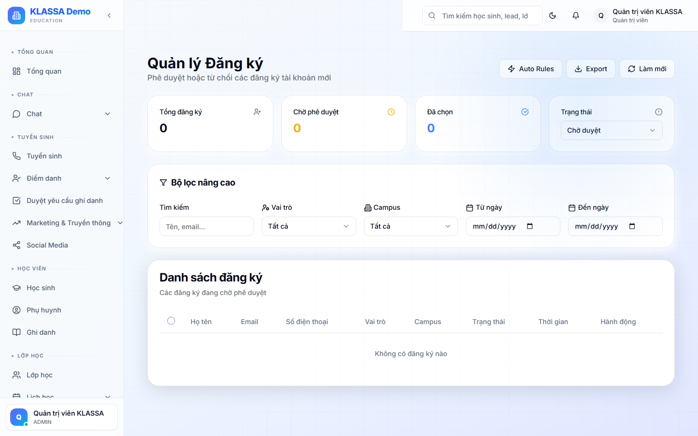

# Duyệt đăng ký người dùng

## Khái niệm

Khi ai đó [tự đăng ký tài khoản](../bat-dau/dang-ky.md) qua trang công khai, yêu cầu vào trang này để Chủ trung tâm / Quản lý **duyệt** trước khi tài khoản hoạt động.

> Khác với [Thu lead từ web](../tuyen-sinh/yeu-cau-dang-ky.md) (đăng ký **học sinh / khách quan tâm**) — đây là duyệt **tài khoản người dùng** đăng nhập vào phần mềm.

## Truy cập

Menu trái → **Cài đặt → Duyệt đăng ký** (`/admin/registrations`). Quyền: Chủ trung tâm (ADMIN).

## Danh sách yêu cầu

Bảng hiển thị mỗi yêu cầu: checkbox · Họ tên · Email · SĐT · Vai trò · Chi nhánh · **Trạng thái** · Thời gian gửi + 2 nút Duyệt / Từ chối.

**3 trạng thái**: 🟡 Chờ duyệt · 🟢 Đã duyệt · 🔴 Từ chối. (Mặc định màn hình lọc sẵn "Chờ duyệt".)

Bộ lọc: Trạng thái · Tìm kiếm (tên/email) · Vai trò · Chi nhánh · Khoảng ngày. Có nút Xuất CSV/JSON.

## Duyệt 1 tài khoản

Bấm **"Duyệt"** trên dòng → hộp thoại xác nhận:

- **Nếu vai trò KHÁC Phụ huynh** → **bắt buộc chọn Chi nhánh** làm việc (user chỉ thấy dữ liệu chi nhánh này). Phụ huynh không cần chọn.
- Bấm **"Phê duyệt"**.

Khi duyệt, hệ thống tự động:
- Kích hoạt tài khoản (đăng nhập được)
- **Tạo hồ sơ nhân sự (Employee)** nếu là vai trò nhân viên (giáo viên, tư vấn, kế toán, nhân sự, quản lý…) — để dùng [Cổng nhân viên](../cong-nhan-vien/gioi-thieu.md). Phụ huynh không tạo hồ sơ nhân sự.
- Gửi **thông báo trong app** cho người dùng biết đã được duyệt.

## Từ chối

Bấm **"Từ chối"** → **bắt buộc nhập lý do từ chối** → xác nhận. Người đăng ký không đăng nhập được.

## Duyệt / từ chối hàng loạt

Tích nhiều dòng (chỉ tab "Chờ duyệt") → bấm **"Phê duyệt hàng loạt"** (nếu có vai trò nhân viên, chọn 1 chi nhánh chung cho cả lô) hoặc **"Từ chối hàng loạt"** (nhập 1 lý do chung).

## Tự động duyệt (Auto Rules)

Tab/route **`/admin/registrations/auto-rules`** — đặt quy tắc tự duyệt/từ chối theo điều kiện (đuôi email, vai trò, chi nhánh…). Phù hợp khi tin tưởng nguồn đăng ký (vd email nội bộ trung tâm).

## Lưu ý

- **Bắt buộc chọn chi nhánh** khi duyệt vai trò nhân viên — bỏ qua bước này, nhân viên vào Cổng nhân viên sẽ thiếu dữ liệu.
- **Cẩn thận phụ huynh tự đăng ký** — có thể trùng phụ huynh do lễ tân tạo. Đối chiếu SĐT trước khi duyệt.

## Câu hỏi thường gặp

**Khác gì với tạo user trực tiếp ở Quản lý người dùng?**
Trang này **duyệt yêu cầu tự đăng ký** (trạng thái chờ → duyệt mới hoạt động). [Quản lý người dùng](nguoi-dung.md) là admin **tạo thẳng** tài khoản, kích hoạt ngay.

**Duyệt nhầm vai trò?**
Vào [Quản lý người dùng](nguoi-dung.md) đổi vai trò sau khi đã duyệt.
