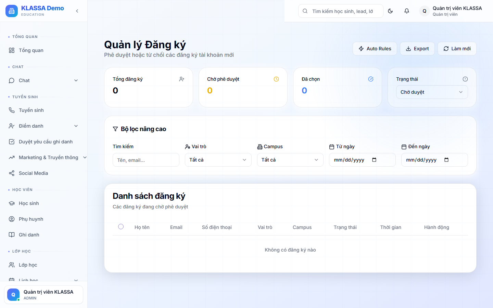

# Duyệt đăng ký người dùng

## Khái niệm

Nếu trung tâm bật **đăng ký tự do** (form đăng ký công khai trên website cho nhân viên / giáo viên / phụ huynh), các yêu cầu đăng ký mới sẽ vào trang này để **Quản lý duyệt** trước khi tài khoản được kích hoạt.

Khác với [Yêu cầu đăng ký từ form web](../tuyen-sinh/yeu-cau-dang-ky.md) (là yêu cầu đăng ký **học sinh** mới), đây là duyệt **tài khoản người dùng** vào hệ thống.

## Khi nào dùng

- Giáo viên cộng tác đăng ký tự do qua form
- Phụ huynh đăng ký tự tạo tài khoản (nếu trung tâm bật)
- Có **quy tắc tự động** duyệt theo điều kiện (vd email đuôi `@truongx.edu.vn` thì auto duyệt)

## Truy cập

Menu trái → **Cài đặt → Duyệt đăng ký** (hoặc **/admin/registrations**).

## Tính năng

### Danh sách yêu cầu

Mỗi yêu cầu hiển thị:
- Họ tên, email, SĐT
- Vai trò yêu cầu (Phụ huynh / Giáo viên / Nhân viên...)
- Ngày gửi
- Trạng thái: Chờ duyệt / Đã duyệt / Từ chối / Spam

### Hành động

- **✅ Duyệt** — tạo tài khoản, gán vai trò, gửi email kích hoạt
- **❌ Từ chối** — ghi lý do, đóng yêu cầu
- **🚫 Spam** — đánh dấu spam (gửi qua bot)

### Quy tắc tự động duyệt

Tab **"Quy tắc"** (`/admin/registrations/auto-rules`) — cấu hình điều kiện auto-duyệt:

- Theo đuôi email (`@truongx.edu.vn` → auto-duyệt)
- Theo vai trò yêu cầu
- Theo mã giới thiệu

## Lưu ý

- **Mặc định KHÔNG mở** đăng ký tự do — chỉ admin tạo tài khoản. Bật trong Cài đặt nếu cần.
- **Cẩn thận với phụ huynh tự đăng ký** — có thể tạo trùng với phụ huynh do lễ tân tạo.

## Câu hỏi thường gặp

**Tôi muốn chỉ giáo viên đăng ký được, không cho phụ huynh, có không?**
Có. Trong Quy tắc → giới hạn vai trò đăng ký.
