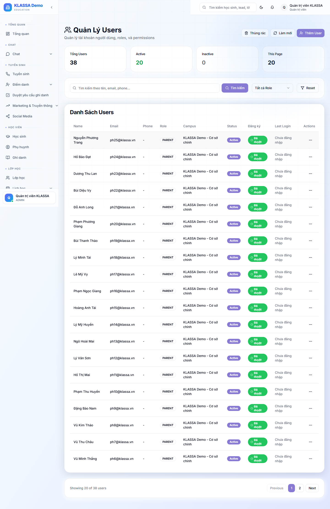

# Quản lý người dùng nội bộ

## Khi nào dùng

- Tạo tài khoản cho nhân viên mới (kích hoạt ngay, không cần duyệt)
- Đổi vai trò khi nhân viên thăng chức / chuyển vị trí
- Vô hiệu hoá tài khoản khi nhân viên nghỉ việc
- Đặt lại mật khẩu cho người quên

## Truy cập

Menu trái → **Cài đặt → Người dùng** (`/admin/users`). Quyền: Chủ trung tâm (ADMIN).

## Tạo tài khoản mới

Bấm **"+ Tạo người dùng"** → hộp thoại:

1. **Họ và tên** \*
2. **Email** \* (không trùng)
3. **Số điện thoại** (tuỳ chọn)
4. **Vai trò** \* (xem [vai trò người dùng](../bat-dau/vai-tro-nguoi-dung.md))
5. **Cơ sở / Chi nhánh** (chọn nếu vai trò ≠ Phụ huynh)
6. **Mật khẩu** \* — **phải nhập** (không có tự sinh)
7. **Kích hoạt** (bật sẵn)

Bấm lưu → tài khoản tạo ở trạng thái **đã duyệt + hoạt động ngay** (đăng nhập được luôn, không qua bước chờ duyệt).

> **Tài khoản vai trò nhân viên** (giáo viên, lễ tân, kế toán, nhân sự, quản lý…) → hệ thống **tự tạo hồ sơ nhân sự (Employee)** để dùng [Cổng nhân viên](../cong-nhan-vien/gioi-thieu.md). Phụ huynh không tạo hồ sơ nhân sự.

> Hệ thống **không tự gửi email** thông tin đăng nhập. Anh chị báo email + mật khẩu cho nhân viên thủ công (hoặc dùng chức năng đặt lại mật khẩu để họ tự đổi).

## Danh sách + thao tác

Bảng: Tên · Email · SĐT · Vai trò · Chi nhánh · Hoạt động · Lần đăng nhập cuối · Ngày tạo. Lọc theo tên/email/SĐT, vai trò, chi nhánh.

Mỗi user có menu thao tác:
- **Chỉnh sửa** — đổi tên, SĐT, vai trò, chi nhánh, kích hoạt (email không đổi được)
- **Đổi vai trò**
- **Đặt lại mật khẩu**
- **Vô hiệu hoá** — tắt hoạt động, không đăng nhập được
- **Xem lịch sử**

## Khoá vs vô hiệu hoá

- **Vô hiệu hoá** (tắt công tắc Hoạt động) — chủ động khoá tài khoản (vd nhân viên nghỉ). Tài khoản còn nhưng không đăng nhập.
- **Khoá tạm thời tự động** — khi ai đó nhập sai mật khẩu nhiều lần, hệ thống tự khoá ~15 phút rồi tự mở (bảo vệ chống dò mật khẩu).

## Xoá người dùng

Không xoá cứng — chỉ **vô hiệu hoá** (giữ lịch sử thao tác). Tài khoản đã xoá có thể khôi phục trong **Thùng rác**.

## Khác biệt: Tạo user vs Duyệt đăng ký

| | **Quản lý người dùng** (`/admin/users`) | **Duyệt đăng ký** (`/admin/registrations`) |
|--|------------------------------------------|---------------------------------------------|
| Ai tạo | Admin tạo thẳng | Người dùng [tự đăng ký](../bat-dau/dang-ky.md) |
| Trạng thái ban đầu | Hoạt động ngay | Chờ duyệt |
| Tự tạo hồ sơ nhân sự | Có (vai trò nhân viên) | Có (khi duyệt) |
| Khi dùng | Chủ trung tâm chủ động thêm NV | NV tự đăng ký, admin duyệt |

## Câu hỏi thường gặp

**Nhân viên báo không đăng nhập được dù đã tạo?**
Kiểm tra công tắc "Hoạt động" có bật không, và báo đúng email + mật khẩu đã đặt cho họ.

**Tạo nhầm vai trò?**
Dùng "Đổi vai trò" trên dòng user.

**Nhân viên vào Cổng nhân viên báo "chưa có hồ sơ nhân sự"?**
Hiếm gặp với tài khoản tạo mới (hệ thống tự tạo hồ sơ). Nếu xảy ra với tài khoản cũ, liên hệ KLASSA để bổ sung hồ sơ nhân sự.
