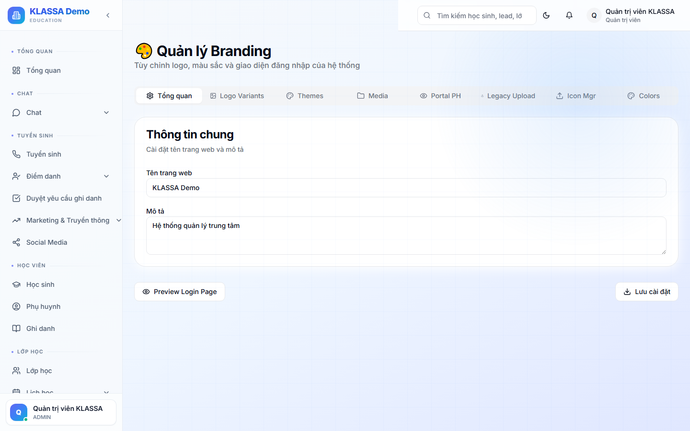

# Thương hiệu — logo, màu sắc, tên trung tâm

## Khi nào dùng

Tuỳ chỉnh diện mạo phần mềm phù hợp thương hiệu trung tâm:

- Logo (hiển thị góc trên + email + hoá đơn)
- Tên trung tâm (hiển thị mọi nơi)
- Màu chủ đạo (giao diện, nút bấm)
- Slogan
- Thông tin liên hệ (chân trang, email)

## Truy cập

Menu trái → **Cài đặt → Thương hiệu** (hoặc **/admin/branding**).

## Các mục cấu hình

### Logo
- Upload PNG / SVG, kích thước 200×200px hoặc rộng hơn
- Có 2 phiên bản: logo sáng (cho nền tối) + logo tối (cho nền sáng)
- Favicon (icon trên tab trình duyệt)

### Thông tin trung tâm
- Tên đầy đủ
- Tên viết tắt
- Slogan
- Địa chỉ chính
- SĐT, email
- Website
- MST

### Màu sắc
- Màu chính (primary) — nút bấm, link
- Màu phụ (secondary)
- Màu nhấn (accent)

KLASSA mặc định indigo-blue-cyan — đổi theo thương hiệu trung tâm.

### Email + tin nhắn
- Mẫu chữ ký email
- Mẫu kết tin Zalo

## Áp dụng

Sau khi lưu, phần mềm tự cập nhật — không cần khởi động lại.

Ảnh hưởng:
- Giao diện toàn trung tâm
- Cổng Phụ huynh
- Email gửi đi
- Hoá đơn PDF
- Báo cáo PDF

## Lưu ý

- **Logo to chất lượng cao** — sẽ in trên hoá đơn, đừng dùng ảnh nhỏ mờ.
- **Test trước**: đổi xong xem các trang chính có ổn không.

## Câu hỏi thường gặp

**Mỗi cơ sở dùng logo khác nhau, được không?**
Có. Mỗi cơ sở có thể có brand override — đặt trong [Quản lý cơ sở](co-so.md).
