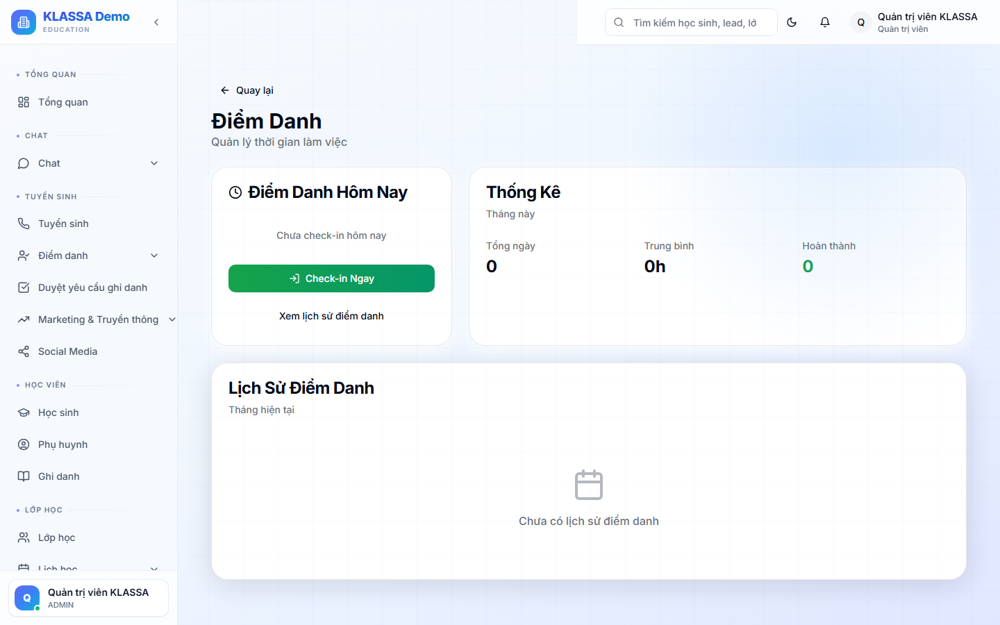

# Chấm công cá nhân

## Cách dùng

Cổng Nhân viên → tab **"Chấm công"**.

## Tính năng

### Check-in / Check-out

- Bấm **"Check-in"** khi đến văn phòng
- Bấm **"Check-out"** khi về

Phần mềm ghi nhận:
- Thời gian
- Vị trí GPS (nếu cho phép)
- Có thể quét QR code văn phòng để xác thực

### Bảng chấm công tháng

Xem mình đã làm bao nhiêu ngày, đi muộn / về sớm bao nhiêu lần.

### Đơn phép

Nộp đơn phép trong tab "Phép" — xem [Quản lý ngày phép](../nhan-su/ngay-phep.md).

## Quên check-in / check-out

- Báo HR ngay → HR sửa thủ công (có ghi nhật ký).
- Tránh quên thường xuyên — ảnh hưởng đánh giá.

## Câu hỏi thường gặp

**Đi công tác, check-in xa văn phòng — có bị sai vị trí không?**
Vào tab "Đi công tác" báo trước → trong những ngày công tác, không cảnh báo sai vị trí.
