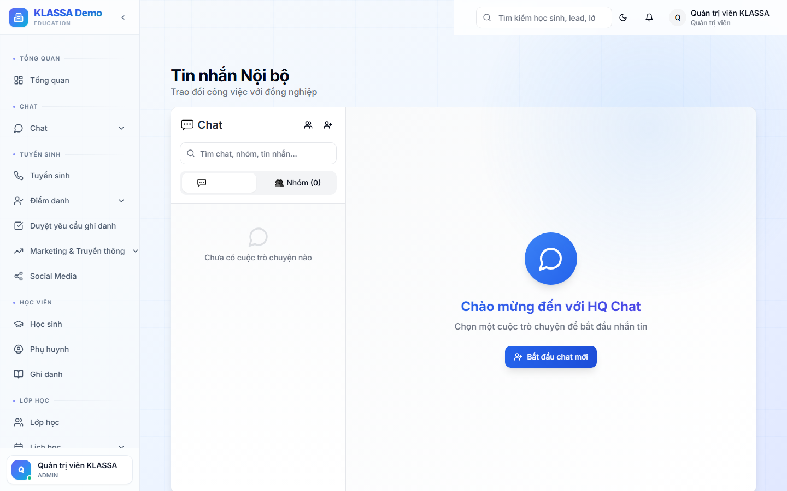

# Chat nội bộ

## Khi nào dùng

Trao đổi với đồng nghiệp trong trung tâm thay vì dùng Zalo / Messenger riêng. Lợi ích:

- Lịch sử lưu trong hệ thống, tìm lại được sau nhiều tháng
- Chia sẻ file / ảnh / voice trong context công việc
- Gắn thẻ học sinh / lớp / hoá đơn vào tin nhắn
- Tin nhắn realtime, không cần làm mới trang
- Tách biệt với chat cá nhân — không lẫn lộn việc với gia đình

## Truy cập

Cổng Nhân viên → tab **"Chat"** (hoặc icon 💬 trên đầu trang).

## 11 tính năng chính

### 1. Tin nhắn realtime

Vừa gõ tin xong, đồng nghiệp thấy ngay — không cần làm mới. Có icon "đang gõ..." khi đối phương đang soạn tin.

### 2. Chat 1-1 và chat nhóm

- **Chat 1-1**: nhắn riêng với 1 đồng nghiệp
- **Chat nhóm**: nhiều người trong cùng cuộc trò chuyện

### 3. Tạo nhóm tuỳ chọn

Bấm "+ Tạo nhóm" → đặt tên + chọn thành viên:

- **Nhóm theo phòng ban** — "GV Toán", "Lễ tân", "Kế toán"
- **Nhóm theo lớp** — "Lớp 9A — GV + Trợ giảng"
- **Nhóm dự án** — "Khai giảng Hè 2026"

### 4. Sửa tin đã gửi

Bấm vào tin của mình → **"Sửa"** → đổi nội dung. Tin được đánh dấu **"(đã sửa)"** để đồng nghiệp biết.

Giới hạn: chỉ sửa được tin trong **15 phút** sau khi gửi. Sau đó tin cố định.

### 5. Trả lời tin cụ thể (Reply)

Khi nhóm đông tin, dùng reply để chỉ rõ đang trả lời câu nào. Hiển thị tin gốc ngay trên tin trả lời.

### 6. Reaction emoji

Thay vì gõ "OK", "Cảm ơn", bấm 👍 / ❤️ / 😄 / 🎉 lên tin để phản hồi nhanh.

### 7. Ghim tin quan trọng

Quản lý có thể **ghim** tin quan trọng lên đầu nhóm (vd thông báo lịch nghỉ lễ). Mọi thành viên thấy ngay.

### 8. Chuyển tiếp tin (Forward)

Gửi nguyên 1 tin sang nhóm khác hoặc người khác — kèm tin gốc + người gửi gốc.

### 9. Voice message

Bấm giữ icon microphone → ghi âm → gửi. Đồng nghiệp bấm play nghe. Phù hợp khi đang lái xe, đang lớp không tiện gõ.

### 10. Tìm tin cũ

Bấm icon kính lúp 🔍 → gõ từ khoá → kết quả từ TẤT cả nhóm (kèm context xung quanh tin).

### 11. Mention @tên

Gõ `@` + tên đồng nghiệp → chọn → người được mention nhận **thông báo đặc biệt** (notification ngay cả khi đang tắt notification của nhóm).

## Đính kèm

- **Ảnh** — kéo thả hoặc paste từ clipboard
- **File** — PDF, Word, Excel, max 25MB/file
- **Voice** — bấm giữ microphone
- **Sticker** — bộ sticker emoji có sẵn

## Tag học sinh / lớp / hoá đơn

Khi đang chat về 1 học sinh / lớp cụ thể, gõ:
- `#HS:Nguyen Van A` → gắn link tới chi tiết học sinh
- `#L:Toán 9A` → gắn link tới lớp
- `#HD:12345` → gắn link tới hoá đơn

Đồng nghiệp click vào tag → mở thẳng trang tương ứng.

## Thông báo

- **Trong app**: chuông thông báo (góc trên), số tin chưa đọc trên icon Chat
- **Email**: nếu user offline > 10 phút và có tin mới
- **Zalo OA**: nếu user bật trong Cài đặt → mention quan trọng

## Quyền

Mặc định mọi nhân viên đăng nhập KLASSA đều dùng được Chat. Cài đặt → Phân quyền có thể giới hạn:
- Một số vai trò chỉ chat 1-1, không tạo nhóm
- Một số vai trò bị giới hạn gửi file > 5MB
- Phụ huynh có cổng chat riêng (Cổng Phụ huynh), không chung với nhân viên

## Lưu ý

- **Không gửi mật khẩu / OTP / dữ liệu siêu nhạy** qua chat — tin được lưu lâu dài.
- **Tin đã xoá** vẫn lưu trong Audit log của Quản lý — không "biến mất" hoàn toàn.
- **Mỗi thiết bị 1 phiên** — đăng nhập máy khác không bị đăng xuất máy cũ.

## Câu hỏi thường gặp

**Có thể gọi voice / video qua chat không?**
Có (plugin **VoiceChat** trả phí). Bấm icon 📞 trong khung chat → đồng nghiệp nhận cuộc gọi.

**Tôi xoá nhầm tin, lấy lại được không?**
Tin xoá biến mất với mọi người nhưng vẫn còn trong audit log. Quản lý có thể recover nếu cần thiết.

**Cuộc trò chuyện 100 ngày trước còn không?**
Còn. KLASSA lưu chat **vô thời hạn** trừ khi Quản lý xoá manual hoặc trung tâm ngừng dịch vụ.

**Nhân viên đã nghỉ việc, lịch sử chat?**
Vẫn lưu, nhưng tài khoản bị khoá → không vào được. Quản lý có thể xem lịch sử qua Audit log.

**Phụ huynh có chat được với nhân viên không?**
Có, qua Cổng Phụ huynh. Tin phụ huynh hiện trong khu vực Chat khách riêng, không lẫn chat nội bộ nhân viên.
