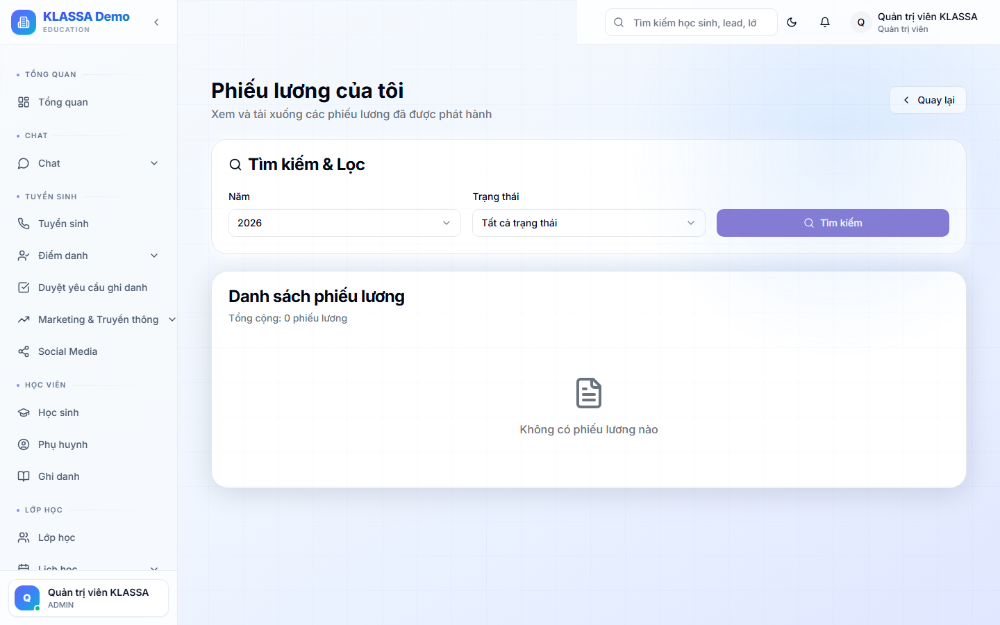

# Phiếu lương cá nhân

## Cách dùng

Cổng Nhân viên → tab **"Phiếu lương"**.

## Hiển thị

### Danh sách phiếu lương

Mỗi tháng = 1 phiếu lương, theo thứ tự thời gian.

### Chi tiết 1 phiếu

- Tháng / năm
- Tổng các khoản:
  - Lương cơ bản
  - Lương buổi dạy (chi tiết từng buổi)
  - Phụ cấp
  - Thưởng
- Tổng các khoản trừ:
  - BHXH / BHYT / BHTN
  - Thuế TNCN
  - Tạm ứng
  - Phạt
- **Lương thực nhận**
- Ngày chuyển khoản
- Mã giao dịch

### Tải PDF

Bấm "Tải phiếu lương PDF" → file đẹp để lưu giấy tờ.

## Khi nào có phiếu lương?

Sau khi kế toán chốt bảng lương (thường ngày 1-5 tháng sau).

## Có thắc mắc về lương

Bấm "Có thắc mắc" → gửi tin cho HR / Kế toán — họ sẽ giải đáp.

## Câu hỏi thường gặp

**Tôi không thấy phiếu lương tháng vừa rồi?**
Có thể chưa chốt. Hỏi HR / Kế toán.
