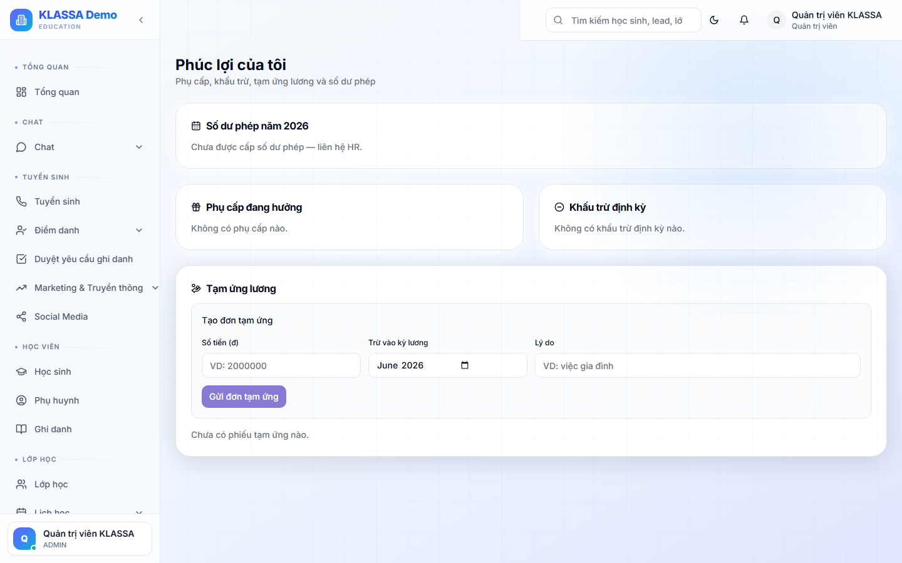

# Phúc lợi

## Khi nào dùng

Xem các phúc lợi mà trung tâm cung cấp cho nhân viên:
- Bảo hiểm (BHXH, BHYT, BHTN)
- Bảo hiểm sức khoẻ bổ sung
- Du lịch / nghỉ dưỡng hàng năm
- Quà sinh nhật / cưới / tang lễ
- Trợ cấp ăn trưa, đi lại, điện thoại
- Học bổng cho con NV
- Thưởng tết, lương tháng 13

## Truy cập

Cổng Nhân viên → tab **"Phúc lợi"** (hoặc **/employee-portal/benefits**).

## Bố cục

### Danh sách phúc lợi đang được hưởng

Mỗi phúc lợi hiển thị:
- Tên + Mô tả
- Giá trị (nếu có thể quy đổi tiền)
- Trạng thái: 🟢 Đang hưởng / 🟡 Chờ kích hoạt / ⚪ Đã hết kỳ
- Ngày bắt đầu — ngày kết thúc

### Phúc lợi sắp đến hạn

Cảnh báo phúc lợi sắp hết:
- Bảo hiểm sức khoẻ sắp hết hạn → cần gia hạn
- Phép năm còn 5 ngày → nên đăng ký nghỉ trước cuối năm

### Đăng ký phúc lợi mới

Một số phúc lợi NV chủ động đăng ký:
- Du lịch hè 2026 — chọn địa điểm + đi cùng vợ/chồng
- Khoá học nâng cao (trung tâm tài trợ 50% học phí)
- Đăng ký dùng phòng tập gym đối tác

## Câu hỏi thường gặp

**Tại sao tôi không thấy phúc lợi A mà đồng nghiệp khác có?**
Phúc lợi tuỳ vai trò + cấp bậc. NV chính thức có nhiều phúc lợi hơn cộng tác viên. Liên hệ HR để hỏi chi tiết.

**Tôi muốn đổi phúc lợi (không nhận quà sinh nhật, đổi sang ngày phép thêm)?**
Một số phúc lợi cho phép trao đổi. Vào trang này → bấm **"Đề xuất trao đổi"** → HR xét duyệt.

**Quyền lợi BHXH thì sao?**
NV xem chi tiết quá trình đóng BHXH trong tab **"Bảo hiểm"** (con của Phúc lợi) — bao gồm thâm niên + dự toán hưu trí.
