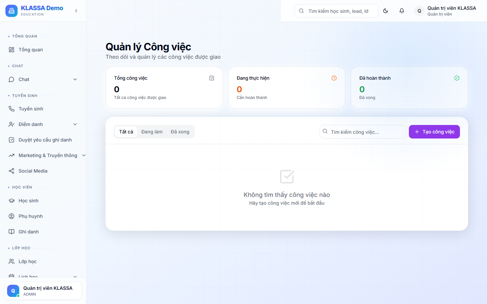

# Việc cần làm hôm nay

## Cách dùng

Cổng Nhân viên → trang chủ → bảng **"Việc cần làm hôm nay"**.

## Phần mềm tự sinh việc cần làm

Tuỳ vai trò:

### Lễ tân / Tư vấn viên
- Lead chưa gọi quá 2 ngày
- Lead hứa gọi lại hôm nay
- Hoá đơn quá hạn cần thu

### Giáo viên
- Buổi dạy sắp diễn ra
- Buổi đã dạy chưa chấm điểm danh
- Bài đánh giá chưa nhập điểm

### Kế toán
- Hoá đơn nháp chờ duyệt
- Phiếu chi chờ ký
- Bảng lương chờ chốt

### HR
- Đơn phép chờ duyệt
- Hợp đồng sắp hết hạn

## Đánh dấu hoàn thành

Bấm tick vào từng việc → đánh dấu xong, biến mất khỏi danh sách.

## Thêm việc cá nhân

Có thể tự thêm việc của mình (như to-do list cá nhân).

## Lưu ý

- Việc tự sinh **không xoá được** — phải xử lý đúng nguyên nhân (ví dụ chấm điểm danh → việc tự biến mất).

## Câu hỏi thường gặp

**Có cảnh báo Zalo nếu nhiều việc quá hạn không?**
Có. Buổi sáng nếu có việc tồn đọng > 3 ngày, hệ thống gửi Zalo nhắc.
