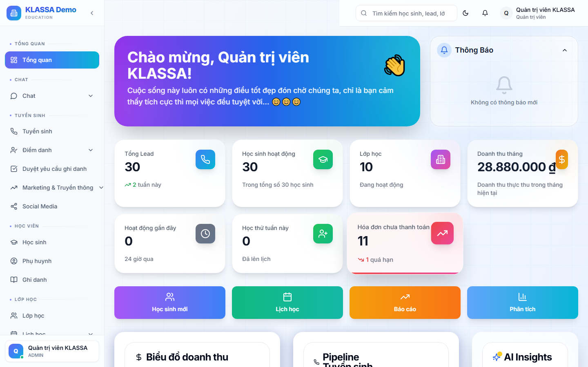

# Xem điểm danh của con

## Cách dùng

Cổng Phụ huynh → tab **"Điểm danh"**.

## Hiển thị

- **Buổi gần nhất**: trạng thái có mặt / vắng / muộn
- **Lịch sử tháng này**: bảng từng buổi
- **Tỷ lệ chuyên cần** (%): TB từ đầu khoá
- **Biểu đồ** xu hướng

## Lọc

- Theo khoá / lớp (nếu con học nhiều môn)
- Theo tháng

## Tải báo cáo

Bấm **"Tải PDF báo cáo"** → file PDF đẹp gửi qua Zalo / lưu máy.

## Lưu ý

- Cập nhật ngay sau khi giáo viên chấm điểm danh.
- Nếu thấy điểm danh sai → bấm **"Báo lỗi"** → trung tâm nhận thông báo + kiểm tra.

## Câu hỏi thường gặp

**Tôi báo nghỉ qua Zalo, vẫn ghi vắng?**
Lễ tân chưa cập nhật vào hệ thống. Nhắc lễ tân hoặc dùng nút "Báo lỗi" để hệ thống đẩy lên.
