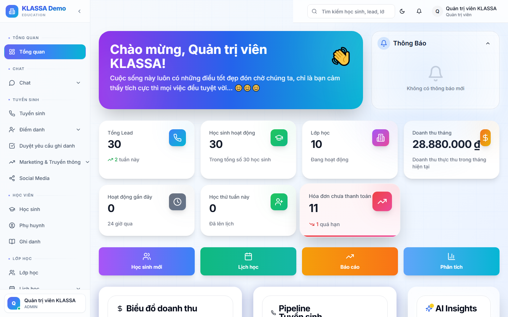

# Xem điểm số

## Cách dùng

Cổng Phụ huynh → tab **"Điểm số"** hoặc **"Học tập"**.

## Hiển thị

### Theo môn

- Danh sách bài đánh giá
- Điểm + hệ số
- Điểm trung bình môn
- Biểu đồ tiến bộ

### Nhận xét

- Nhận xét của giáo viên theo tuần / tháng
- Kỹ năng (chuyên cần, tích cực, tiếp thu...)
- Đề xuất phát triển

### Báo cáo cuối kỳ

- PDF báo cáo đầy đủ — tải về để lưu hoặc in
- Thông báo Zalo khi báo cáo có sẵn

## Lưu ý

- Phụ huynh **không xem điểm của HS khác** — tôn trọng quyền riêng tư.
- Chỉ giáo viên + trung tâm có quyền nhập điểm — phụ huynh không sửa được.

## Câu hỏi thường gặp

**Điểm thấp, tôi muốn trao đổi với giáo viên?**
Bấm "Liên hệ giáo viên" trong cùng trang — gửi tin trực tiếp.
