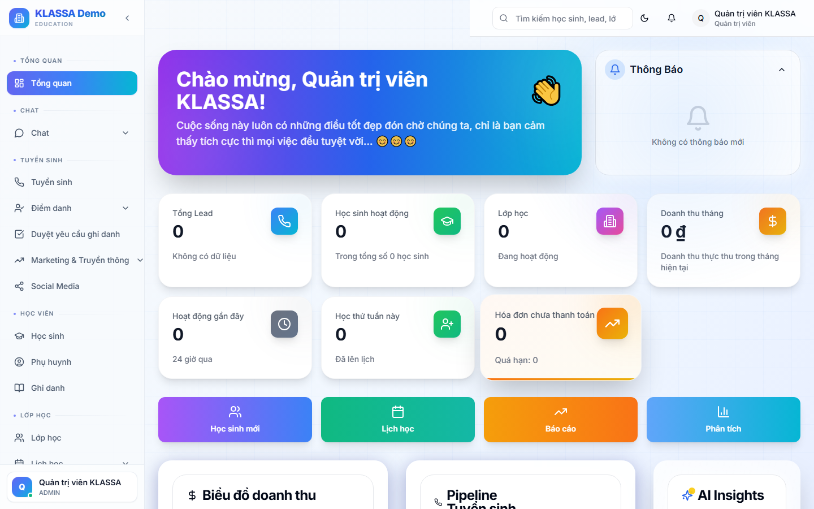

# Xem hoá đơn

## Cách dùng

Cổng Phụ huynh → tab **"Hoá đơn"**.

## Hiển thị

- **Đã thanh toán** — danh sách + ngày thanh toán
- **Chưa thanh toán** — danh sách + hạn + nút "Thanh toán ngay"
- **Quá hạn** — đỏ nổi bật

Mỗi hoá đơn bấm vào → xem chi tiết:
- Các môn / khoá
- Đơn giá × số lượng
- Khuyến mãi áp dụng
- Tổng

## Thanh toán online

Bấm **"Thanh toán ngay"** → chọn phương thức:
- VNPay (ATM, thẻ tín dụng)
- Momo
- ZaloPay
- Quét VietQR

Sau khi thanh toán thành công → hoá đơn tự đổi trạng thái "Đã thanh toán".

## Tải file

- Tải PDF hoá đơn
- Tải hoá đơn điện tử (nếu trung tâm dùng e-Invoice)

## Câu hỏi thường gặp

**Đóng nhầm, hoàn tiền thế nào?**
Liên hệ trung tâm. Sau khi xác minh, trung tâm tạo phiếu hoàn tiền — phụ huynh nhận lại qua chuyển khoản.
