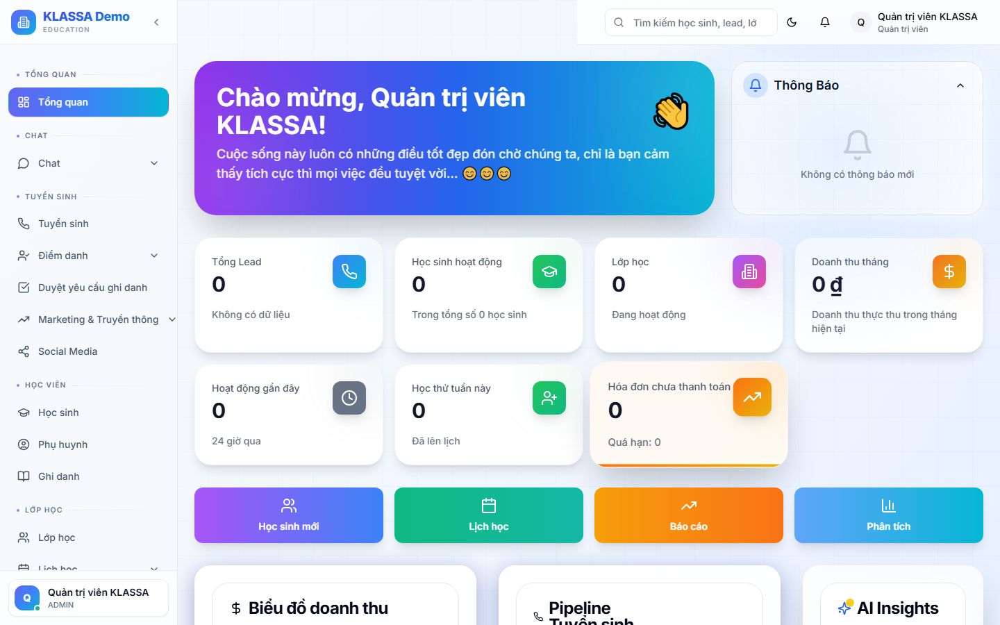

# Gửi phản hồi cho trung tâm

## Khi nào dùng

- Khen / chê giáo viên
- Góp ý cải thiện dịch vụ
- Báo lỗi phần mềm
- Đề xuất tính năng

## Cách dùng

Cổng Phụ huynh → tab **"Phản hồi"** → bấm **"+ Gửi phản hồi"**:

- **Loại**: Khen / Chê / Góp ý / Báo lỗi / Khác
- **Đối tượng**: Trung tâm chung / Giáo viên X / Lễ tân X
- **Đánh giá sao** (1-5 sao)
- **Nội dung**: text mô tả
- **Đính kèm** (tuỳ chọn): ảnh, video làm bằng chứng

Có thể **gửi ẩn danh** (trung tâm không biết phụ huynh nào gửi) — phục vụ phản hồi nhạy cảm.

## Theo dõi

Sau khi gửi, phụ huynh thấy trạng thái:
- 🟡 Đã gửi
- 🟢 Trung tâm đã xem
- ✅ Đã phản hồi

## Lưu ý

- Phản hồi tích cực **được trung tâm quý** — đừng ngại khen.
- Đánh giá sao GV ảnh hưởng đến đánh giá cuối kỳ của GV — dùng có trách nhiệm.

## Câu hỏi thường gặp

**Phản hồi ẩn danh có thật sự ẩn không?**
Có. Hệ thống không lưu danh tính người gửi cho mục phản hồi ẩn danh. Chỉ Quản lý + Chủ trung tâm thấy nội dung.
