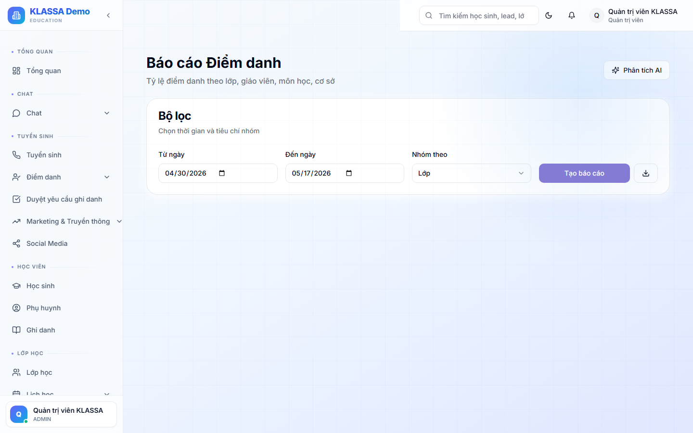

# Báo cáo điểm danh

## Khi nào dùng

- Phụ huynh hỏi tình hình con: bao nhiêu buổi đã học, nghỉ mấy buổi
- Báo cáo tháng cho chủ trung tâm
- Phát hiện học sinh nghỉ nhiều (nguy cơ bỏ học)
- Đánh giá chuyên cần lớp / giáo viên

## Truy cập

Menu trái → **Báo cáo → Điểm danh**.



## Các loại báo cáo

### 1. Báo cáo theo học sinh

Chọn 1 học sinh → xem:

- Tổng buổi đã chấm
- Số có mặt / vắng / muộn / học bù
- **Tỷ lệ chuyên cần** (%)
- Biểu đồ chuyên cần 30 ngày
- Lịch sử chi tiết từng buổi

Bấm **"In báo cáo cho phụ huynh"** → PDF đẹp gửi qua Zalo / email.

### 2. Báo cáo theo lớp

Chọn 1 lớp → xem:

- Tỷ lệ chuyên cần TB của lớp
- Top học sinh đi học đầy đủ nhất / nghỉ nhiều nhất
- Buổi nào có nhiều người vắng (có thể do trùng lịch học khác, lễ…)

### 3. Báo cáo theo giáo viên

Xem chuyên cần của tất cả lớp 1 giáo viên dạy:
- Có lớp nào tỷ lệ vắng cao bất thường?
- Giáo viên dạy nhiều = lớp khác nhau có khác biệt rõ về chuyên cần?

### 4. Báo cáo tổng toàn trung tâm

- Tỷ lệ chuyên cần TB toàn trung tâm
- So sánh giữa các cơ sở
- So sánh các tháng

## Cách tính tỷ lệ chuyên cần

Công thức KLASSA dùng:

```
Tỷ lệ = (Có mặt + Đi muộn + Học bù) ÷ (Tổng buổi - Buổi trung tâm huỷ) × 100%
```

Lưu ý:

- **Buổi trung tâm huỷ** (CENTER_CANCELLED) không tính cả tử số lẫn mẫu số → không phạt học sinh
- **Vắng có phép** (EXCUSED) tính vào tử số = 0 — tức là vắng, nhưng có lý do
- **Đi muộn** (LATE) vẫn tính là **có học** → không phạt chuyên cần

## Xuất file

- **Excel** — dữ liệu chi tiết để phân tích
- **PDF** — báo cáo trình bày đẹp, gửi cho cấp trên hoặc phụ huynh

## Lưu ý

- **Báo cáo cập nhật theo thời gian thực** — vừa chấm điểm danh, báo cáo cập nhật ngay.
- **Báo cáo tháng**: dùng bộ lọc ngày để chọn đầu - cuối tháng.

## Câu hỏi thường gặp

**Học sinh có tỷ lệ <70% có cảnh báo tự động không?**
Có. Vào **Báo cáo → Học sinh có nguy cơ (at-risk)** — phần mềm liệt kê học sinh có tỷ lệ chuyên cần thấp.

**Có thể gửi báo cáo định kỳ tự động cho phụ huynh không?**
Có. Trong **Cài đặt → Thông báo định kỳ** → bật "Gửi báo cáo tháng cho phụ huynh" → chọn ngày trong tháng.
