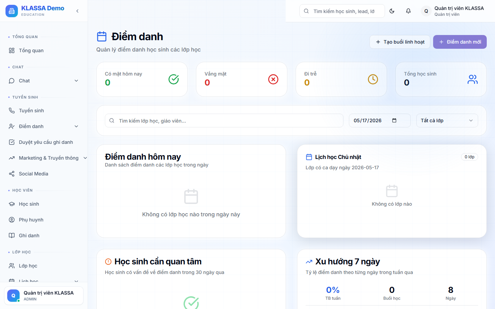

# Chấm điểm danh hàng ngày

## Khi nào dùng

Hằng ngày, **giáo viên** chấm điểm danh ngay trong buổi học hoặc ngay sau buổi.

Điểm danh là cơ sở để:

- Tính lương giáo viên (theo số buổi đã dạy)
- Báo phụ huynh tình hình con
- Tính học phí (học sinh nghỉ có / không tính phí)
- Báo cáo chuyên cần cuối tháng

## Cách 1 — Từ lịch dạy

1. Vào **Lịch dạy** → bấm vào buổi học hôm nay
2. Bấm nút **"Chấm điểm danh"**

## Cách 2 — Từ menu Điểm danh

1. Menu trái → **Điểm danh**
2. Chọn lớp → chọn buổi cần chấm

## 4 trạng thái điểm danh

| Biểu tượng | Trạng thái | Ý nghĩa |
|:-:|----|------|
| ✅ | **Có mặt** (PRESENT) | Học sinh đã đến lớp |
| ❌ | **Vắng** (ABSENT) | Vắng có lý do hoặc không lý do |
| 🕐 | **Đi muộn** (LATE) | Đến muộn nhưng vẫn học |
| 🔁 | **Học bù** (MAKEUP) | Học sinh học bù từ lớp khác sang |

Ngoài ra có 2 trạng thái phụ:
- **EXCUSED** — Vắng có phép (đã thông báo trước)
- **CENTER_CANCELLED** — Trung tâm huỷ buổi (không tính nghỉ cho học sinh)

## Các bước chấm

1. Bảng hiện ra với danh sách học sinh trong lớp
2. Mặc định tất cả ở trạng thái "Có mặt"
3. Đổi trạng thái cho học sinh vắng / muộn / học bù bằng cách bấm vào ô
4. Có thể **thêm ghi chú** cho từng học sinh ("Báo nghỉ ốm", "Đến muộn 15 phút")
5. Bấm **"Lưu"** ở góc phải

## Sau khi lưu

- Trạng thái buổi chuyển sang **"Đã chấm"** (🟢)
- Phụ huynh nhận thông báo Zalo về trạng thái con (nếu trung tâm bật)
- Buổi được tính vào tổng số buổi đã dạy (phục vụ lương)

## Lưu ý

- **Chấm xong vẫn sửa được** — bấm vào buổi đã chấm để chỉnh sửa. Mọi thay đổi đều được ghi lại trong nhật ký.
- **Buổi quá hạn chưa chấm**: phần mềm tự nhắc giáo viên qua thông báo + Zalo.
- **Chấm cho lớp đông**: dùng **"Chấm hàng loạt"** — chọn nhiều học sinh cùng trạng thái → đặt một lúc.

## Câu hỏi thường gặp

**Giáo viên quên chấm hôm trước, hôm nay chấm có được không?**
Được, nhưng phần mềm ghi nhận "chấm muộn". Quản lý có thể xem nhật ký để phát hiện thói quen chấm muộn.

**Trợ giảng chấm thay giáo viên được không?**
Được nếu được Quản lý cấp quyền. Mặc định trợ giảng chỉ xem, không chấm.

**Học sinh đến muộn quá nửa buổi, tính sao?**
Tuỳ quy định trung tâm. Mặc định LATE vẫn tính là đi học (cho lương + cho học phí). Một số trung tâm coi như vắng nếu muộn quá 30 phút — chỉnh quy định trong **Cài đặt → Điểm danh**.
