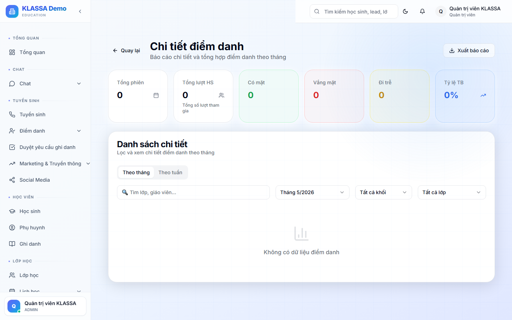

# Sửa điểm danh sai

## Khi nào dùng

- Giáo viên chấm nhầm trạng thái học sinh
- Quên chấm 1 học sinh
- Học sinh báo vắng sau khi đã chấm
- Lễ tân phát hiện sai khi nhận tin nhắn từ phụ huynh

## Cách 1 — Sửa nhanh từ trang điểm danh

1. Vào lớp → buổi cần sửa
2. Bấm vào ô trạng thái của học sinh cần đổi
3. Chọn trạng thái đúng
4. Bấm **"Lưu thay đổi"** ở góc trên

## Cách 2 — Sửa từ trang chi tiết học sinh

Phù hợp khi cần sửa nhiều buổi cho cùng 1 học sinh:

1. Mở chi tiết học sinh
2. Tab **"Điểm danh"** → bảng tất cả buổi đã chấm
3. Bấm vào ô cần sửa → đổi trạng thái

## Ai được sửa?

| Vai trò | Quyền sửa |
|---------|-----------|
| **Giáo viên** | Sửa được điểm danh do mình chấm, trong **24 giờ** sau buổi |
| **Lễ tân** | Sửa được khi có vai trò "Đối chiếu" |
| **Quản lý** | Sửa được mọi điểm danh, mọi thời điểm |
| **Chủ trung tâm** | Quyền cao nhất |

Sau 24 giờ, giáo viên muốn sửa phải nhờ Quản lý.

## Lý do bắt buộc

Khi sửa điểm danh đã quá 24 giờ hoặc với vai trò Quản lý, phần mềm yêu cầu **ghi lý do** — để truy vết về sau.

Các lý do gợi ý:

- Giáo viên chấm nhầm
- Học sinh đến muộn (sau giờ chấm)
- Phụ huynh báo nghỉ muộn
- Sai dữ liệu nhập
- Khác

## Nhật ký thay đổi

Mỗi lần sửa được ghi vào **Nhật ký điểm danh** (Quản lý xem được):

- Ai sửa
- Sửa từ → đến (giá trị cũ → mới)
- Lúc nào
- Lý do

Nhật ký này KHÔNG XOÁ ĐƯỢC — đảm bảo minh bạch.

## Ảnh hưởng khi sửa

- **Lương giáo viên**: nếu kỳ lương chưa chốt, lương tự cập nhật. Nếu đã chốt, phải làm phụ trội thủ công.
- **Học phí**: thay đổi có thể ảnh hưởng tính buổi nghỉ — phần mềm tự cập nhật hoá đơn nếu chưa thanh toán.
- **Báo cáo chuyên cần**: chỉ số tự tính lại.

## Lưu ý

- **Không sửa hàng loạt 1 lần** quá nhiều buổi của 1 học sinh — sẽ làm nhật ký nhiễu. Sửa từng buổi.
- **Sửa nhiều = vấn đề quy trình** — Quản lý nên xem có giáo viên nào hay chấm nhầm để training lại.

## Câu hỏi thường gặp

**Tôi sửa nhầm, có lấy lại được giá trị cũ không?**
Mở nhật ký điểm danh → tìm dòng vừa sửa → bấm "Hoàn tác". Chỉ Quản lý làm được.

**Sửa điểm danh trong báo cáo lương đã chốt, lương có tự cập nhật không?**
Không. Lương đã chốt là cố định. Phải làm phụ trội (thưởng / trừ) trong kỳ lương sau.
