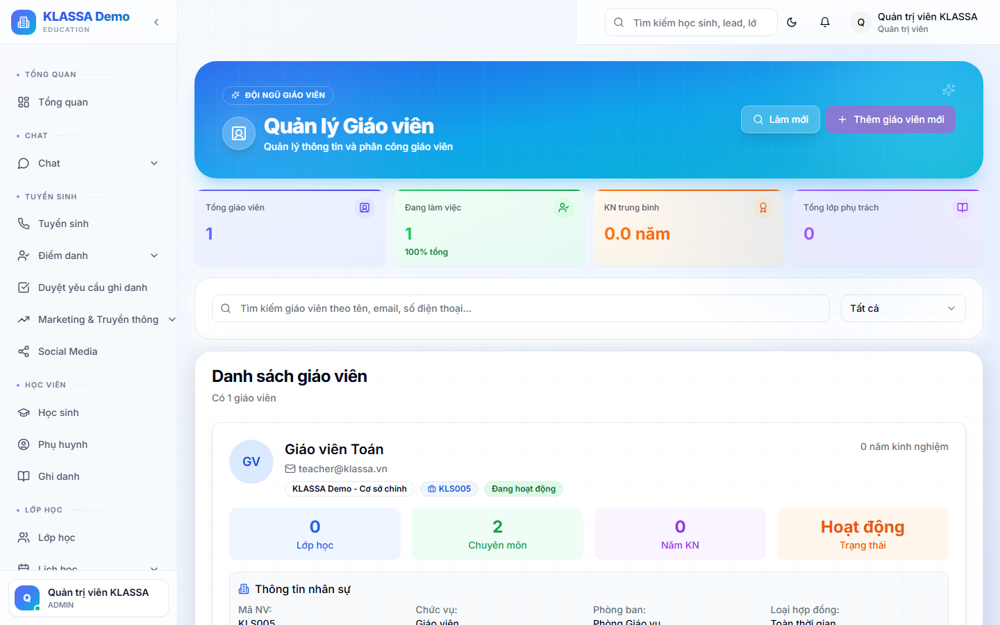

# Danh sách giáo viên

## Khi nào dùng

- Tra cứu nhanh giáo viên trong trung tâm
- Xếp lịch dạy
- Phân tích năng suất giảng dạy

## Truy cập

Menu trái → **Giáo viên**.

## Khác Nhân viên thế nào?

Trang **Giáo viên** chỉ hiển thị nhân viên có vai trò **TEACHER** hoặc **TEACHING_ASSISTANT** — tập trung vào việc giảng dạy.

Trang **Nhân viên** (HR) hiển thị toàn bộ nhân viên — tập trung vào nhân sự, hợp đồng, lương.

## Bộ lọc

- **Môn dạy** — Toán, Tiếng Anh, Văn…
- **Khối lớp** — Tiểu học, THCS, THPT
- **Cơ sở**
- **Loại hợp đồng** — Chính thức / Cộng tác
- **Trạng thái** — Đang dạy / Tạm nghỉ / Đã nghỉ

## Bảng danh sách

- Ảnh + Tên + Mã GV
- Môn dạy chính
- Số lớp đang dạy
- Tỷ lệ chuyên cần lớp (chỉ số chất lượng)
- Lương tháng trước
- Đánh giá phụ huynh (số sao TB)

## Lưu ý

- **Đánh giá phụ huynh** lấy từ [Phản hồi](../phan-hoi/tiep-nhan.md) — phụ huynh chấm sao GV cuối mỗi tháng.
- **Tỷ lệ chuyên cần** = TB của các lớp GV dạy — chỉ số gián tiếp chất lượng giảng dạy.

## Câu hỏi thường gặp

**Tôi không thấy trợ giảng trong danh sách, ở đâu?**
Bộ lọc → "Vai trò" → tick "Trợ giảng". Mặc định chỉ hiện Giáo viên chính.
