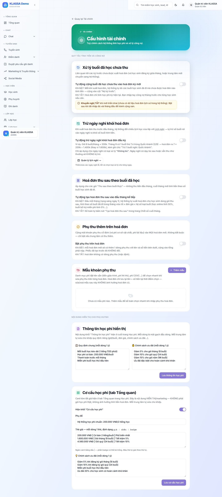

# Cài đặt tài chính

## Khi nào dùng

Đặt các quy tắc tính tiền + công nợ cho **từng cơ sở**, và nội dung học phí hiển thị cho phụ huynh.

## Truy cập

Menu trái → **Học phí → Cài đặt** (`/finance/settings`). Cấu hình lưu **theo từng cơ sở** — tài khoản chưa gắn cơ sở sẽ thấy công tắc bị khoá + cảnh báo.

> Lưu ý: **chế độ thu học phí (thu trước / thu sau / không trừ credit) KHÔNG đặt ở đây** — đặt ở [gói học phí](quan-ly-hoc-phi.md) và ghi đè theo từng học sinh khi ghi danh.

## Nhóm 1 — Quy tắc tính tiền & công nợ

### 1. Tự động cộng buổi đã học chưa thu
Công tắc **"Tự động cộng buổi đã học chưa thu vào hoá đơn kỳ mới"** (mặc định **TẮT**). Bật → buổi học sinh đã đi tháng trước nhưng chưa kịp xuất phiếu sẽ được gom vào mục "Nợ kỳ trước" của hoá đơn kỳ mới. *Khuyến nghị để TẮT khi mới triển khai* cho đỡ rối.

### 2. Trừ ngày nghỉ khỏi hoá đơn (lịch nghỉ)
Công tắc **"Tự động trừ ngày nghỉ khỏi hoá đơn đầu kỳ"** (mặc định **TẮT**). Khi bật:
- Hoá đơn đầu kỳ (chế độ thu trước) **không tính tiền các buổi rơi vào ngày nghỉ** đã khai báo.
- Cạnh công tắc có nút **"Quản lý lịch nghỉ →"** dẫn sang trang [Ngày nghỉ lễ](../cai-dat/ngay-nghi-le.md) (`/settings/holidays`) để khai báo ngày nghỉ.

> Đây là **"lịch nghỉ trong cấu hình tài chính"**: bản thân ngày nghỉ khai ở trang Ngày nghỉ lễ chung, còn công tắc này quyết định **có trừ tiền** những ngày đó khỏi hoá đơn hay không. Chỉ áp dụng cho gói **thu trước**.

### 3. Tự động tạo hoá đơn thu sau
Công tắc **"Tự động tạo hoá đơn thu sau vào đầu tháng kế tiếp"** (mặc định **BẬT**) — chỉ áp cho gói **"Thu sau theo buổi thực"**. Bật → rạng sáng ngày 1 hệ thống tự xuất hoá đơn theo buổi đã học. Tắt → kế toán bấm tay nút **"Tạo hoá đơn thu sau"** ở trang chốt sổ.

### 4. Phụ thu thêm trên hoá đơn
Công tắc **"Phụ thu"** (mặc định TẮT) + ô **Tên phụ thu** + **Số tiền phụ thu**. Bật → cộng một khoản cố định vào **mọi hoá đơn tạo sau khi lưu** (hoá đơn cũ giữ nguyên; chống thu trùng theo học sinh + kỳ).

### 5. Mẫu khoản phụ thu
Bảng quản lý **danh mục phí đặt sẵn** (giáo trình, thi thử, cơ sở vật chất…): Tên khoản phí · Số tiền · Mô tả · Đang dùng. Khi sửa phụ thu trên từng hoá đơn, chọn nhanh từ danh mục này. Hoá đơn lưu lại tên + số tiền tại thời điểm tạo → sửa/xoá mẫu **không ảnh hưởng** hoá đơn cũ.

## Nhóm 2 — Nội dung hiển thị cho phụ huynh (chỉ marketing)

> Hai mục này **chỉ để hiển thị**, KHÔNG ảnh hưởng tính tiền.

### 6. Thông tin học phí hiển thị
2 ô văn bản: **"Quy định chung"** + **"Chính sách ưu đãi"** → hiển thị cho phụ huynh xem. Có nút "Lưu thông tin học phí" riêng.

### 7. Cơ cấu học phí (tab Tổng quan)
Công tắc bật/tắt + ô Phụ đề + ô "Thẻ giá" (mỗi dòng: `giá | nhãn | nhãn nổi bật`) + Chính sách ưu đãi. Hiển thị thành bảng giá đẹp ở trang Tổng quan tài chính. **Đây chỉ là bảng giá trưng bày, không phải gói học phí thật.**

## Lưu ý

- Cấu hình **theo từng cơ sở** — mỗi chi nhánh đặt riêng được.
- Không có ở đây (docs cũ ghi nhầm): đơn vị tiền tệ, quy tắc đến hạn, tự động nhắc nợ, chính sách hoàn tiền, phí phạt quá hạn, cấu hình cổng thanh toán. Cổng thanh toán (MoMo/VNPay/SePay) cấu hình ở [Thu - chi](thu-chi.md).

## Câu hỏi thường gặp

**Tôi muốn buổi nghỉ lễ không tính tiền cho phụ huynh?**
Bật công tắc "Tự động trừ ngày nghỉ khỏi hoá đơn", rồi khai ngày nghỉ trong [Ngày nghỉ lễ](../cai-dat/ngay-nghi-le.md). Áp cho gói thu trước.

**Phụ thu khác mẫu khoản phụ thu thế nào?**
"Phụ thu" (mục 4) cộng cố định vào MỌI hoá đơn. "Mẫu khoản phụ thu" (mục 5) là danh mục để chọn nhanh khi thêm phí cho TỪNG hoá đơn cụ thể.
