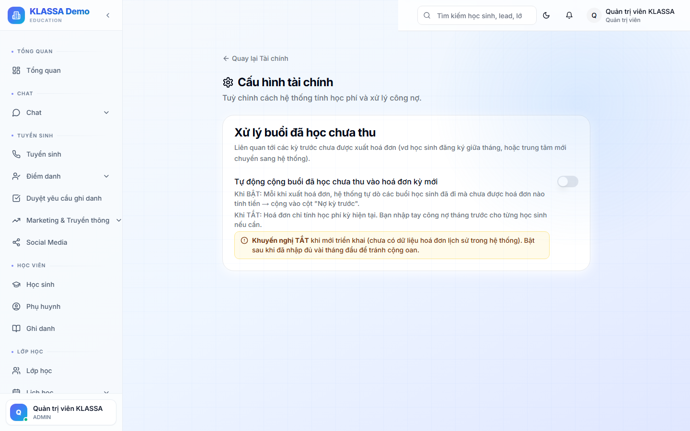

# Cài đặt tài chính

## Khi nào dùng

Cấu hình các quy tắc tài chính chung cho toàn trung tâm:

- Đơn vị tiền tệ
- Quy tắc thanh toán (đến hạn, nhắc nợ)
- Khuyến mãi mặc định
- Chính sách hoàn tiền
- Tự động đối soát ngân hàng

## Truy cập

Menu trái → **Học phí & Hoá đơn → Cài đặt** (hoặc **/finance/settings**).

## Các mục cấu hình

### 1. Đơn vị tiền tệ

- VNĐ (mặc định)
- USD / EUR / khác (cho trung tâm phục vụ khách nước ngoài)
- Định dạng số (1.000.000 vs 1,000,000)

### 2. Quy tắc đến hạn

- **Hoá đơn đến hạn** sau bao nhiêu ngày từ ngày xuất bản (mặc định 7 ngày)
- **Nợ quá hạn** = quá hạn bao nhiêu ngày (mặc định 14 ngày)
- **Tự động nhắc nợ** trước hạn X ngày + đúng hạn + quá hạn

### 3. Tự động gửi nhắc nợ

Bật để KLASSA tự gửi Zalo / email nhắc phụ huynh:

- 3 ngày trước hạn — nhắc lịch sự
- Đúng hạn — báo đến hạn
- 3 ngày quá hạn — nhắc lần 2
- 7 ngày quá hạn — gọi điện (nhắc Kế toán gọi)

### 4. Khuyến mãi tự động

- Anh chị em — con thứ N giảm bao nhiêu %
- Đóng dài hạn — đóng X tháng giảm Y%
- Học sinh giới thiệu bạn — giảm cho cả 2

### 5. Chính sách hoàn tiền

- **Không hoàn** — học phí đã đóng = không trả lại
- **Hoàn theo tỷ lệ** — học X% thì hoàn (100-X)%
- **Bảo lưu** — chuyển sang khoá khác

### 6. Phí phạt quá hạn

Một số trung tâm tính phí phạt khi phụ huynh đóng muộn (ví dụ 50k / tuần quá hạn). Bật / tắt + cấu hình tại đây.

### 7. Tài khoản ngân hàng

Liệt kê các tài khoản ngân hàng trung tâm dùng để nhận chuyển khoản:

- Tên ngân hàng
- Số tài khoản
- Tên chủ TK
- Mã QR VietQR (tự động sinh)

Các thông tin này tự xuất hiện trên hoá đơn để phụ huynh chuyển.

### 8. Tích hợp thanh toán online

Kết nối các cổng thanh toán:

- **VNPay** — thẻ ATM, thẻ tín dụng
- **Momo**
- **ZaloPay**
- **VietQR** (mặc định, không phí)

Phụ huynh có thể bấm link trong hoá đơn để thanh toán ngay không cần chuyển khoản thủ công.

## Lưu ý

- **Khuyến mãi tự động** ảnh hưởng hoá đơn mới tạo, không ảnh hưởng hoá đơn cũ.
- **Tự động gửi nhắc nợ**: chỉ bật khi đã kết nối Zalo OA hoặc email SMTP.

## Câu hỏi thường gặp

**Đổi đơn vị tiền tệ giữa chừng, dữ liệu cũ có bị ảnh hưởng không?**
Không. Dữ liệu cũ vẫn hiển thị bằng đơn vị cũ. Đơn vị mới áp cho giao dịch sau khi đổi.

**Tôi muốn từng cơ sở có khuyến mãi riêng, được không?**
Được. Trong Cài đặt → Khuyến mãi → mỗi khuyến mãi có "Phạm vi áp dụng" — chọn cơ sở cụ thể.
