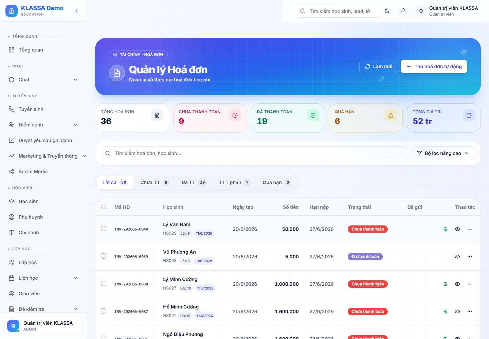
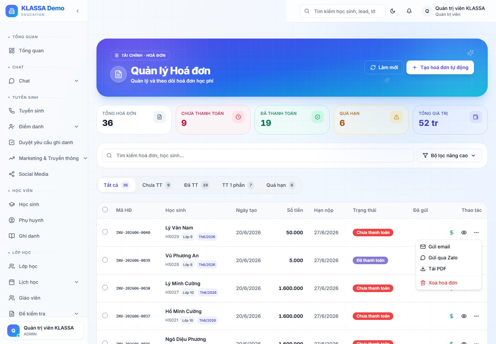

# Gửi hoá đơn qua Zalo cho phụ huynh

## Khi nào dùng

Sau khi tạo hoá đơn học phí, gửi thẳng cho phụ huynh qua **Zalo** — kèm **ảnh hoá đơn + mã QR thanh toán** để phụ huynh quét trả ngay. Gửi được **1 phụ huynh**, **cả lớp/nhóm**, hoặc **theo khối** — tất cả trong cùng một cửa sổ.

> Dùng kênh **[Zalo cá nhân](../tich-hop/zalo-ca-nhan.md)** (số Zalo của trung tâm). Phụ huynh cần đã **kết bạn Zalo** với trung tâm thì mới nhận được tin riêng.

## Mở cửa sổ "Gửi hoá đơn qua Zalo"

Vào **Học phí → Kế toán → Hoá đơn** (`/finance/accounting/invoices`). Có **3 cách mở** tuỳ nhu cầu:

| Cách gửi | Bấm vào đâu |
|----------|-------------|
| **Gửi 1 phụ huynh** (đơn lẻ) | Menu **⋯** trên dòng hoá đơn → **"Gửi Zalo"** |
| **Gửi hàng loạt** (các hoá đơn đã chọn) | Tích chọn nhiều hoá đơn → thanh nổi hiện nút **"Gửi Zalo (N)"** |
| **Gửi theo khối** | Nút **"Gửi Zalo theo khối"** ở đầu trang → chọn khối lớp |

Cả 3 đều mở cùng cửa sổ **"Gửi hoá đơn qua Zalo"**.

## Trong cửa sổ gửi

### Bước 1 — Chọn nơi nhận

- **Phụ huynh** — gửi riêng vào Zalo từng phụ huynh (1 đối 1). Cần phụ huynh đã kết bạn Zalo.
- **Nhóm lớp Zalo** — gửi vào nhóm Zalo của lớp (cần lớp đã liên kết nhóm Zalo). Gửi vào nhóm **chỉ gửi được ảnh**, không gửi tin chữ.

### Bước 2 — Chọn kiểu gửi

- **Gửi ảnh hoá đơn** (khuyên dùng) — gửi **ảnh hoá đơn + mã QR VietQR** (nếu còn nợ) → phụ huynh quét trả ngay, kèm lời nhắn.
- **Gửi tin nhắn** — chỉ gửi chữ, không ảnh (chỉ dùng khi gửi cho phụ huynh).

### Bước 3 — Soạn lời nhắn (caption)

Có sẵn mẫu, anh chị chỉnh được. Dùng các biến tự điền:
- `[ten_hoc_sinh]` · `[ten_lop_hoc]` · `[so_tien]` · `[han_thanh_toan]` · `[so_hoa_don]`

Mẫu mặc định:
> Kính gửi Phụ huynh em **[ten_hoc_sinh]**, Trung tâm xin gửi thông báo học phí lớp **[ten_lop_hoc]**: **[so_tien]** (hạn **[han_thanh_toan]**). Số hoá đơn: [so_hoa_don]. Xin cảm ơn Quý Phụ huynh!

Lời nhắn tối đa 400 ký tự, tự lưu lại cho lần sau. Bấm **"Xem trước mẫu"** để xem ảnh hoá đơn + lời nhắn trước khi gửi.

### Bước 4 — Bấm "Gửi Zalo (N)"

Phần mềm gửi **lần lượt từng người**, cách nhau vài giây (chống Zalo khoá). Có **thanh tiến độ** + kết quả: ✓ thành công · ✕ lỗi · ⊘ bỏ qua.

## Lưu ý quan trọng

- **Giữ tab mở** đến khi gửi xong. Gửi nhiều (>50 hoá đơn) có thể mất 5–15 phút (mỗi người cách ~6 giây để Zalo không chặn).
- **Phụ huynh chưa kết bạn Zalo** với trung tâm → bị **bỏ qua** (hiện nhãn "chưa kết nối"). Số bị bỏ qua hiển thị trên cửa sổ.
- **Mã QR thanh toán** chỉ kèm khi hoá đơn còn nợ — phụ huynh quét là chuyển khoản đúng nội dung, [SePay tự khớp](thu-chi.md).
- Gửi vào **nhóm lớp** cần lớp đã liên kết nhóm Zalo (nút "Nhóm lớp Zalo" mờ nếu chưa có).

## Câu hỏi thường gặp

**Phụ huynh không nhận được hoá đơn?**
Kiểm tra phụ huynh đã kết bạn Zalo với số của trung tâm chưa (nếu chưa sẽ bị bỏ qua). Hoặc tài khoản [Zalo cá nhân](../tich-hop/zalo-ca-nhan.md) của trung tâm có đang "Đang hoạt động" không.

**Gửi cả lớp một lần được không?**
Được — 2 cách: gửi vào **nhóm lớp Zalo** (1 tin cho cả nhóm), hoặc **gửi hàng loạt** từng phụ huynh (tích chọn các hoá đơn của lớp). Gửi riêng từng phụ huynh kín đáo hơn (mỗi nhà chỉ thấy hoá đơn của con mình).

**Gửi theo khối là gì?**
Chọn 1 khối (vd Lớp 9) → phần mềm lấy tất cả học sinh còn nợ của khối đó → gửi hoá đơn hàng loạt. Tiện cho đợt thu học phí đầu tháng.

**Có gửi qua Zalo OA chính thức được không?**
Cửa sổ này dùng Zalo cá nhân. Nếu trung tâm dùng [Zalo OA](../tich-hop/zalo-oa.md), tin nhắc học phí (ZNS) được gửi tự động theo sự kiện — không gửi tay ở đây.
