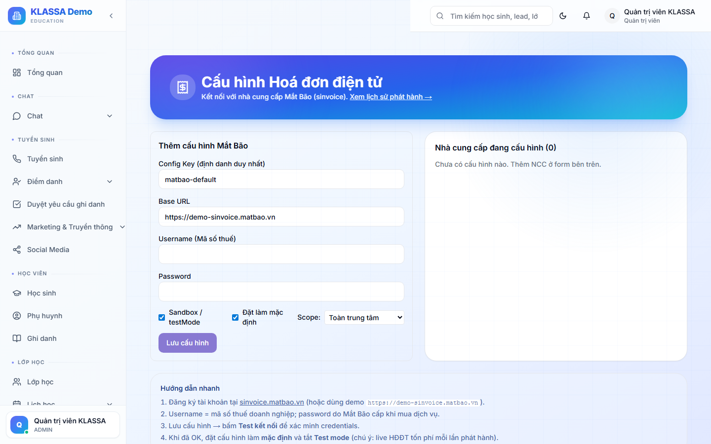

# Hoá đơn điện tử (e-Invoice)

## Khái niệm

Theo quy định **Nghị định 123/2020/NĐ-CP**, doanh nghiệp Việt Nam phải sử dụng **hoá đơn điện tử** (e-Invoice) thay cho hoá đơn giấy. KLASSA hỗ trợ phát hành hoá đơn điện tử có MST + chữ ký số.

## Khi nào cần dùng

- Trung tâm là **doanh nghiệp có MST** (không phải hộ kinh doanh cá thể)
- Phụ huynh yêu cầu xuất hoá đơn để công ty của họ thanh toán
- Đảm bảo tuân thủ luật thuế

Trung tâm là hộ kinh doanh cá thể thì **không bắt buộc** dùng e-Invoice — phiếu thu là đủ.

## Truy cập cấu hình

Menu trái → **Cài đặt → Hoá đơn điện tử** (hoặc **/settings/einvoice**).

## Bước 1 — Đăng ký nhà cung cấp

KLASSA tích hợp với các nhà cung cấp e-Invoice tại Việt Nam:

- **VNPT Invoice**
- **Misa meInvoice**
- **EasyInvoice**
- **Viettel SInvoice**
- **VinaCheck**

Trung tâm cần đăng ký với 1 nhà cung cấp trước (ngoài KLASSA) để có tài khoản phát hành.

## Bước 2 — Cấu hình tích hợp

Trong **Cài đặt → Hoá đơn điện tử**:

- Chọn nhà cung cấp
- Nhập:
  - API Key / Token
  - Tài khoản phát hành
  - Mật khẩu chữ ký số
  - Mã thuế trung tâm (MST)

Bấm **"Kết nối"** → phần mềm test kết nối.

## Bước 3 — Cấu hình mẫu hoá đơn

- Chọn mẫu (Mẫu số 1/001, 1/002, …)
- Ký hiệu (vd C26TKL)
- Số bắt đầu (vd 00000001)
- Logo + thông tin trung tâm

## Phát hành hoá đơn điện tử

### Cách 1 — Tự động khi tạo hoá đơn KLASSA

Trong **Cài đặt → Hoá đơn điện tử** bật **"Tự động phát hành"** — mỗi hoá đơn KLASSA tự gửi sang nhà cung cấp để cấp số.

### Cách 2 — Thủ công từng hoá đơn

Mở hoá đơn → bấm **"Phát hành hoá đơn điện tử"** → chờ vài giây → có số hoá đơn + mã số tham chiếu.

## Gửi hoá đơn điện tử cho khách

Sau khi phát hành:

- **Email** — phụ huynh nhận file PDF + link tra cứu trên website Tổng cục Thuế
- **Zalo** — gửi link
- **In** — in ra giấy nếu khách cần (giá trị pháp lý vẫn ở bản điện tử)

## Tra cứu hoá đơn

Phụ huynh / cơ quan thuế có thể tra cứu hoá đơn trên website của nhà cung cấp:
- vinvoice.vn / meinvoice.vn / easyinvoice.com.vn...

## Lưu ý

- **Khi đã phát hành** không sửa được, chỉ huỷ + phát hành lại (theo quy định pháp luật).
- **Phí phát hành** do nhà cung cấp e-Invoice tính (thường 200-500đ/hoá đơn). KLASSA không thu phí thêm.
- **Lưu trữ 10 năm** theo quy định — nhà cung cấp e-Invoice tự lo.

## Câu hỏi thường gặp

**Trung tâm tôi mới đăng ký, có cần dùng e-Invoice ngay không?**
Theo luật: doanh nghiệp mới phải dùng e-Invoice ngay. Hộ kinh doanh cá thể có ngưỡng doanh thu, dưới ngưỡng có thể chưa cần.

**KLASSA có hỗ trợ hoá đơn không có mã của cơ quan thuế không?**
Có. Một số trung tâm dùng "Hoá đơn chuyển sang cơ quan thuế trong ngày" — KLASSA hỗ trợ cả 2 loại.

**Nếu nhà cung cấp e-Invoice của tôi không có trong danh sách, làm sao?**
Liên hệ KLASSA — đội kỹ thuật có thể tích hợp thêm nhà cung cấp theo yêu cầu.
