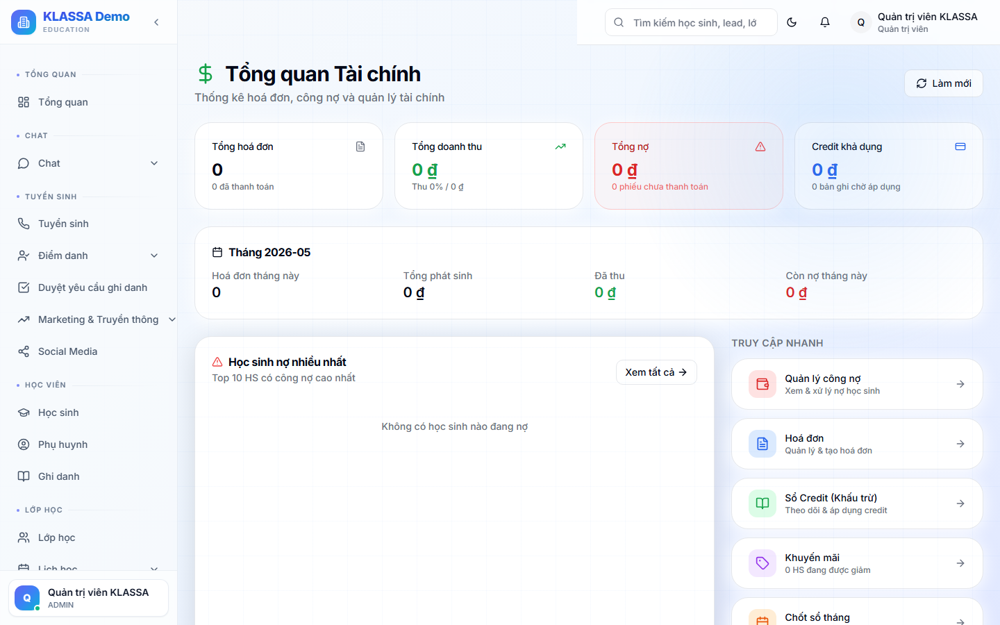

# Kế toán nội bộ

## Khái niệm

Module **Kế toán** hỗ trợ trung tâm theo dõi sổ sách kế toán nội bộ (không thay thế phần mềm kế toán chuyên nghiệp như MISA / FAST nhưng đủ cho trung tâm nhỏ-vừa).

## Truy cập

Menu trái → **Học phí & Hoá đơn → Kế toán** (hoặc **/finance/accounting**).

## Các sổ kế toán có sẵn

### 1. Sổ nhật ký chung

Mọi giao dịch ghi theo thứ tự thời gian:
- Ngày
- Số chứng từ
- Diễn giải
- Tài khoản Nợ / Có
- Số tiền

### 2. Sổ cái

Phân loại theo tài khoản kế toán Việt Nam:
- 111 — Tiền mặt
- 112 — Tiền gửi ngân hàng
- 131 — Phải thu khách hàng
- 331 — Phải trả người bán
- 511 — Doanh thu
- 642 — Chi phí quản lý
- ... v.v.

### 3. Bảng cân đối kế toán

Tài sản = Nguồn vốn — báo cáo cuối kỳ.

### 4. Báo cáo lưu chuyển tiền tệ

Tiền vào - tiền ra theo 3 nhóm: hoạt động kinh doanh / đầu tư / tài chính.

## Cấu hình tài khoản kế toán

Vào **Cài đặt → Kế toán → Danh mục tài khoản**:

- Mặc định theo thông tư 200/2014/TT-BTC
- Có thể tuỳ chỉnh: thêm tài khoản con, đổi tên

## Hạch toán tự động

Mỗi giao dịch thu/chi trong KLASSA **tự sinh bút toán**:

- Phụ huynh đóng học phí qua chuyển khoản:
  - Nợ 112 (tiền gửi NH)
  - Có 511 (doanh thu)
- Chi lương giáo viên:
  - Nợ 642 (chi phí quản lý)
  - Có 111 (tiền mặt)

→ Kế toán không phải gõ tay từng bút toán.

## Khoá kỳ

Cuối tháng / quý: **Khoá kỳ** để không ai sửa được giao dịch trong kỳ đã khoá.

Chỉ Chủ trung tâm mở khoá kỳ lại được (cần lý do).

## Xuất file cho kế toán thuế

- **Excel chuẩn** — gửi cho kế toán thuế ngoài để khai báo
- **Báo cáo VAT** — nếu trung tâm nộp VAT

## Lưu ý

- KLASSA **không thay thế** phần mềm kế toán chuyên nghiệp. Trung tâm có doanh thu lớn nên dùng MISA / FAST song song.
- **Số liệu phải khớp** giữa KLASSA và phần mềm kế toán chính — đối chiếu hàng tháng.

## Câu hỏi thường gặp

**Tôi không có kiến thức kế toán, dùng module này có hiểu được không?**
Dùng được phần thu chi cơ bản (như xem doanh thu, chi phí). Phần sổ cái + cân đối kế toán cần nghiệp vụ — nếu không hiểu, để Kế toán làm.

**Có thể xuất hoá đơn VAT trong module này không?**
Có. Xem [Hoá đơn điện tử (e-Invoice)](hoa-don-dien-tu.md).
