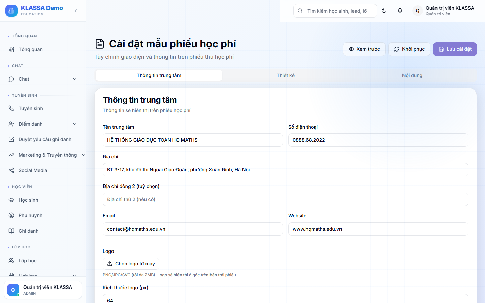

# Tuỳ chỉnh mẫu hoá đơn

## Khi nào dùng

- Trung tâm muốn hoá đơn có logo riêng, màu sắc thương hiệu
- Cần thêm thông tin đặc biệt (lời cảm ơn, mã QR thanh toán)
- Khác biệt giữa các cơ sở (mỗi cơ sở có mẫu riêng)

## Truy cập

Menu trái → **Cài đặt → Mẫu hoá đơn** (hoặc **/settings/invoice-template**).

## Các phần có thể tuỳ chỉnh

### 1. Logo

Upload logo trung tâm (PNG hoặc SVG, kích thước khuyến nghị 200×200px).

### 2. Thông tin trung tâm

- Tên đầy đủ
- Địa chỉ
- Số điện thoại
- Email
- Website
- Mã số thuế (nếu có)

### 3. Màu sắc thương hiệu

- Màu chính (đầu trang, viền)
- Màu phụ (số liệu, nhấn mạnh)

Mặc định KLASSA dùng tông xanh dương — trung tâm có thể đổi theo brand.

### 4. Nội dung

- **Lời chào** trên đầu hoá đơn ("Kính gửi quý phụ huynh...")
- **Lời cảm ơn** cuối hoá đơn
- **Điều khoản** (đóng học phí, hoàn trả, đổi lớp)
- **Số tài khoản ngân hàng** để chuyển khoản
- **Mã QR thanh toán** (VietQR) — phụ huynh quét bằng app NH

### 5. Mẫu A4 vs A5

- **A4** — chuẩn, có nhiều chỗ ghi thông tin
- **A5** — nhỏ gọn, tiết kiệm giấy in

## Xem trước

Bấm nút **"Xem trước"** → hiển thị hoá đơn mẫu với dữ liệu thật của 1 học sinh.

## Áp dụng

- **Áp dụng cho toàn trung tâm** — mọi cơ sở dùng chung mẫu
- **Áp dụng riêng từng cơ sở** — mỗi cơ sở 1 mẫu

## Mẫu có sẵn

KLASSA cung cấp 3 mẫu sẵn:

1. **Cổ điển** — trang trọng, viền đậm, logo lớn
2. **Hiện đại** — thiết kế tối giản, nhiều khoảng trắng
3. **Vui tươi** — màu sắc, biểu tượng — phù hợp trung tâm trẻ em

Bấm **"Dùng mẫu"** → áp dụng ngay rồi tuỳ chỉnh tiếp.

## Lưu ý

- **Hoá đơn điện tử** dùng mẫu của nhà cung cấp e-Invoice, không phải mẫu này. Mẫu này áp dụng cho hoá đơn KLASSA + phiếu thu.
- **Test in trước** khi triển khai chính thức để chắc chắn layout đúng.

## Câu hỏi thường gặp

**Tôi không có logo, dùng tên trung tâm chữ thay được không?**
Được. Bỏ trống ô logo → phần mềm tự dùng tên trung tâm in đậm thay vào.

**Có thể thêm chữ ký + dấu trung tâm vào hoá đơn không?**
Có. Upload ảnh chữ ký + dấu (PNG nền trong suốt) → phần mềm chèn vào cuối hoá đơn.
