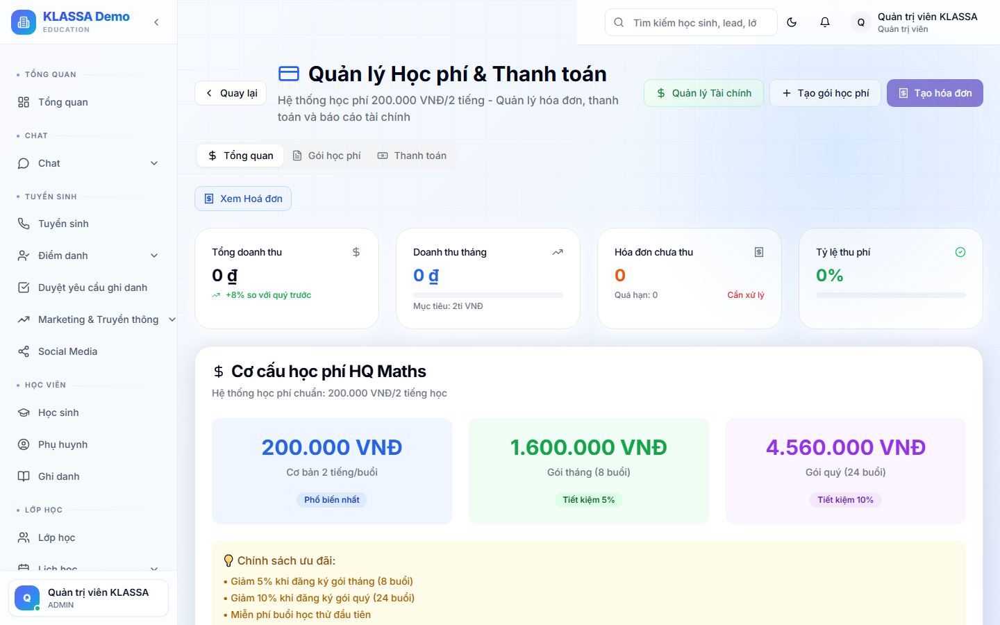

# Quản lý học phí

## Khái niệm

**Học phí** là khoản tiền phụ huynh đóng để con học một khoá. KLASSA cho phép cấu hình học phí ở 3 cấp:

1. **Theo khoá học** — học phí mặc định khi tạo lớp mới
2. **Theo lớp** — có thể đổi khác khoá (lớp VIP, lớp giảm giá)
3. **Theo từng ghi danh** — có thể đổi cho từng học sinh (khuyến mãi cá nhân)

## Truy cập

Menu trái → **Học phí & Hoá đơn → Học phí** (hoặc **/finance/tuition**).

## Cấu hình học phí theo khoá

Trang **Khoá học** → bấm vào khoá → tab Học phí:

- **Cách tính**:
  - Trọn gói khoá (ví dụ 3 triệu / khoá 12 buổi)
  - Theo buổi (250k/buổi × số buổi)
  - Theo tháng (500k/tháng)
- **Số buổi / tháng** (nếu tính theo tháng)
- **Khuyến mãi mặc định** — ví dụ "Đóng 6 tháng giảm 10%"

## Khuyến mãi và giảm giá

### Khuyến mãi áp dụng tự động

Vào **Cài đặt tài chính → Khuyến mãi** → tạo các loại:

- **Anh chị em** — 2 con cùng học → con thứ 2 giảm 15%
- **Đóng dài hạn** — đóng 6 tháng → giảm 10%, 12 tháng → giảm 20%
- **Khuyến mãi đầu khoá** — học sinh mới giảm 200k

Khi tạo hoá đơn, phần mềm tự áp các khuyến mãi học sinh đủ điều kiện.

### Khuyến mãi mã code

Tạo mã (ví dụ `SUMMER2026`) → phụ huynh nhập khi đăng ký → tự giảm.

### Giảm giá thủ công

Khi tạo hoá đơn riêng cho 1 học sinh:
- Bấm **"+ Thêm giảm giá"** → nhập số tiền hoặc %
- Ghi lý do
- Bấm **Lưu**

## Học phí nhiều môn

Học sinh học cả Toán + Tiếng Anh + Văn → 3 ghi danh × 3 hoá đơn (hoặc gộp thành 1 hoá đơn).

Khi gộp: chọn **"Hoá đơn gộp tháng"** → 1 hoá đơn duy nhất / tháng cho phụ huynh, nhưng dòng chi tiết tách rõ từng môn.

## Lưu ý

- **Học phí áp khi ghi danh** — sau khi ghi danh, học phí đó cố định cho ghi danh đó. Đổi học phí của khoá không ảnh hưởng học sinh đã ghi danh.
- **Cài đặt VAT**: nếu trung tâm có xuất hoá đơn VAT, cấu hình thuế suất trong **Cài đặt → Hoá đơn**.

## Câu hỏi thường gặp

**Học sinh nghỉ giữa tháng, học phí tính sao?**
Tuỳ chính sách trung tâm:
- **Không hoàn**: học phí đã đóng = đã trả, không hoàn dù nghỉ.
- **Hoàn theo buổi**: tính lại theo số buổi đã học × đơn giá.

Đặt chính sách trong **Cài đặt tài chính → Chính sách hoàn**.

**Đóng học phí qua nhiều lần (trả góp), được không?**
Được. Hoá đơn có thể chia thành nhiều lần thu — mỗi lần nhận thanh toán một phần.
