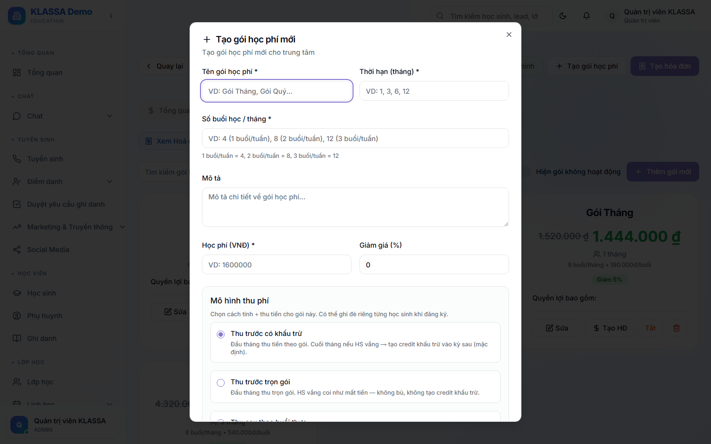
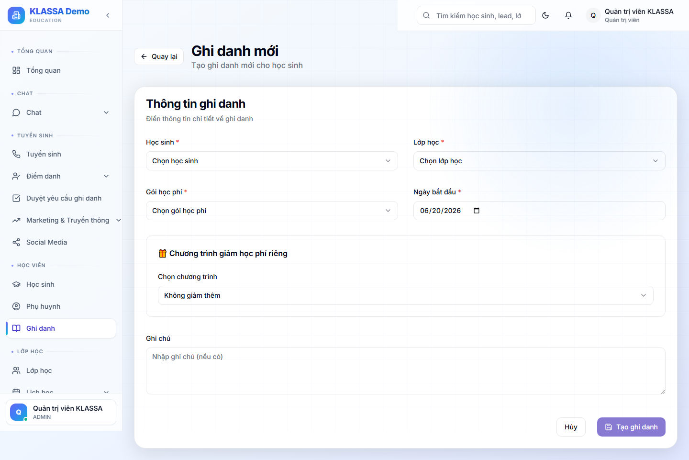

# Quản lý học phí

## Khái niệm

KLASSA quản lý học phí qua **gói học phí** gán cho từng học sinh khi ghi danh. Điểm cốt lõi (mới từ 2026) là **3 chế độ thu học phí (mô hình thu phí)** — quyết định trung tâm thu tiền *trước* hay *sau* khi học, và có *bù tiền buổi vắng* hay không.

## 3 chế độ thu học phí

Đây là phần quan trọng nhất. Mỗi gói học phí (hoặc từng học sinh) chọn 1 trong 3:

| Chế độ | Thu khi nào | Học sinh vắng buổi | Dùng cho |
|--------|-------------|--------------------|----------|
| **Thu trước có khấu trừ** *(mặc định)* | Đầu tháng, thu theo gói (số buổi × đơn giá) | **Sinh tín chỉ bù** = số buổi vắng × giá → tự trừ vào hoá đơn tháng sau | Trung tâm thu trước, công bằng cho phụ huynh |
| **Thu trước trọn gói** *(không trừ credit)* | Đầu tháng, thu đủ tiền gói | **KHÔNG bù** — coi như mất tiền buổi đó | Lớp đóng trọn gói, không hoàn buổi vắng |
| **Thu sau theo buổi thực** *(học trước thu sau)* | **Cuối tháng**, tính theo số buổi **đã học thật** | Không liên quan (chỉ trả buổi đã đi) | Lớp linh hoạt, học bao nhiêu trả bấy nhiêu |

### Giải thích từng chế độ

**1. Thu trước có khấu trừ** (`PREPAY_WITH_CREDIT`)
- Đầu tháng xuất hoá đơn thu theo gói.
- Học sinh vắng → cuối tháng (khi [chốt sổ](ke-toan.md)) hệ thống sinh **tín chỉ bù** (tính bằng tiền) = số buổi vắng × giá buổi.
- Tín chỉ này tự **trừ vào hoá đơn tháng sau của đúng môn đó**.
- Đây là chế độ **CÓ trừ credit** — phổ biến nhất, công bằng.

**2. Thu trước trọn gói — KHÔNG trừ credit** (`PREPAY_NO_CREDIT`)
- Đầu tháng vẫn thu **đủ tiền gói** như chế độ 1.
- Học sinh vắng → **KHÔNG sinh tín chỉ, không bù tiền** (đúng nghĩa "đóng trọn gói").
- Đây chính là chế độ **"KHÔNG trừ credit"**.
- *Ngoại lệ:* tín chỉ admin **tặng / chuyển / hoàn thủ công** vẫn được áp (chỉ tín chỉ do *vắng* mới không sinh).

**3. Thu sau theo buổi thực — học trước thu sau** (`POSTPAY_ACTUAL`)
- **KHÔNG** xuất hoá đơn đầu tháng.
- Cuối tháng mới tính tiền = tổng các buổi **đã đi** (có mặt / đi muộn / học bù) × đơn giá × **hệ số loại buổi**.
- Hệ số loại buổi: buổi thường/học bù/bổ trợ = **100%**, buổi **online = 50%**, buổi **hỗ trợ miễn phí = 0%**.
- Buổi trung tâm huỷ + buổi vắng có phép: **không tính tiền**.
- Chế độ này **không dùng tín chỉ** (đã tính đúng buổi thực).

## Tạo gói học phí + chọn chế độ thu

1. Vào **Học phí → Quản lý học phí** (`/finance/tuition`) → tab **"Gói học phí"**.
2. Bấm **"Tạo gói học phí"** (hoặc Sửa gói có sẵn) → hộp thoại.

3. Điền: tên gói, đơn giá buổi, số buổi/kỳ, chu kỳ (mặc định theo tháng), và **"Mô hình thu phí"** (chọn 1 trong 3 chế độ trên).
   - Chọn "Thu sau theo buổi thực" sẽ hiện cảnh báo "không xuất hoá đơn đầu tháng".

## Ghi đè chế độ cho từng học sinh

Mặc định học sinh theo chế độ của gói. Nhưng có thể **ghi đè riêng cho 1 học sinh** khi [ghi danh](../lop-hoc/ghi-danh.md):

- Trang **Ghi danh** (tạo / sửa) có khối **"💳 Mô hình thu phí"** → tick "ghi đè" → chọn 1 trong 3 chế độ.
- Không tick = theo gói.

- Danh sách ghi danh hiển thị nhãn "Riêng: Thu trọn gói / Thu sau / Thu trước + khấu trừ" nếu học sinh có ghi đè.

> Quy tắc: **ghi đè của học sinh thắng mặc định của gói.** Cả hai không đặt → mặc định "Thu trước có khấu trừ".

## Tín chỉ (credit) khi học sinh nghỉ

- **Tín chỉ tính bằng TIỀN** (VNĐ), không phải đếm số buổi.
- Sinh khi: học sinh vắng (chế độ "Thu trước có khấu trừ") + **đã có hoá đơn kỳ đó** (đã trả tiền gói).
- Mỗi tín chỉ gắn với **đúng một môn** → trừ vào hoá đơn kỳ sau của môn đó.
- Học sinh **nghỉ hẳn một môn** → tín chỉ dư của môn đó **tự tràn sang môn còn học** của cùng học sinh.
- **Buổi trung tâm huỷ** không tính vắng, không sinh tín chỉ.
- Theo dõi tín chỉ ở [Kế toán nội bộ](ke-toan.md) + [Báo cáo tín chỉ](../bao-cao/tin-chi.md).

## Khuyến mãi / giảm giá

Khi ghi danh, người nhập **tự chọn** chương trình giảm giá (server KHÔNG tự áp theo điều kiện). Các chương trình mặc định:

| Chương trình | Mức giảm |
|--------------|----------|
| Anh chị em (con thứ 2 trở đi) | 25% |
| Học nhiều môn (mỗi môn) | 5% |
| Nhóm bạn | 5% |
| Khuyến mãi | 50% |
| Học bổng | 100% |
| Tuỳ chỉnh | nhập tay |

Quản lý chương trình ở [Kế toán nội bộ](ke-toan.md) → Chương trình giảm giá; mức % tenant tự đổi được. **Mã giảm giá / coupon** (vd `SUMMER2026`) thuộc **plugin "Giới thiệu & Coupon"** (trả phí), không có sẵn trong core.

## Cách tính tiền trên 1 hoá đơn

Đơn giá gói × số kỳ → trừ giảm giá gói → trừ giảm giá ghi danh (% hoặc số tiền) → cộng phụ thu (nếu bật) → **tổng cuối**.

> Hoá đơn học phí thường **không có dòng thuế VAT**. VAT chỉ áp dụng khi dùng [Hoá đơn điện tử](hoa-don-dien-tu.md).

## Câu hỏi thường gặp

**Học sinh nghỉ giữa tháng, học phí xử lý sao?**
Tuỳ chế độ thu: "Thu trước có khấu trừ" → sinh tín chỉ bù trừ kỳ sau; "Thu trước trọn gói" → mất tiền buổi vắng; "Thu sau theo buổi thực" → vốn chỉ trả buổi đã học. **Không có hoàn tiền mặt tự động** — hệ thống dùng tín chỉ khấu trừ.

**Đổi chế độ thu giữa chừng được không?**
Được — sửa ở gói (áp cho HS mới) hoặc ghi đè từng HS ở trang Ghi danh. Hoá đơn đã xuất không đổi.

**Tại sao subtitle ghi "200.000đ/2 tiếng"?**
Đó là dòng mô tả cấu hình theo từng trung tâm — đổi được trong [Cài đặt tài chính](cai-dat.md), không phải con số cố định.
