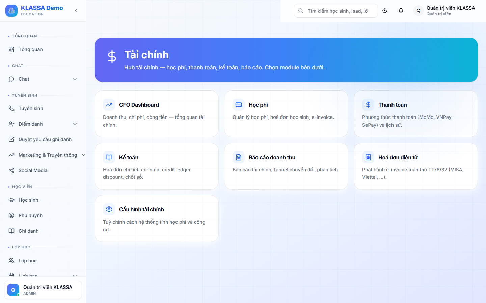

# Tạo và gửi hoá đơn

## Khi nào dùng

- Học sinh mới ghi danh → tạo hoá đơn đầu khoá
- Đầu mỗi tháng → tạo hoá đơn tháng cho tất cả học sinh
- Bổ sung học phí khi học sinh ghi danh thêm môn

## Cách 1 — Tạo từng hoá đơn riêng

### Bước 1 — Vào trang Học phí & Hoá đơn

Menu trái → **Học phí & Hoá đơn**.

### Bước 2 — Bấm "+ Tạo hoá đơn"

### Bước 3 — Chọn học sinh + ghi danh

- Chọn học sinh
- Chọn ghi danh (môn nào, lớp nào)
- Số tháng / số buổi muốn đóng

### Bước 4 — Xem hoá đơn nháp

Phần mềm tự tính:
- Đơn giá gói × số kỳ
- Trừ giảm giá gói + giảm giá ghi danh (% hoặc số tiền)
- Cộng phụ thu (nếu bật trong [Cài đặt tài chính](cai-dat.md))
- **Tổng cuối cùng**

> Hoá đơn học phí thường **không có dòng thuế VAT**. VAT chỉ áp dụng khi dùng [Hoá đơn điện tử](hoa-don-dien-tu.md).

Có thể thêm dòng thủ công:

- **+ Thêm khuyến mãi** — giảm theo % hoặc số tiền cố định
- **+ Thêm dòng phụ thu** — phí vật tư, sách, đồng phục…
- **+ Thêm ghi chú** — ghi rõ nội dung hoá đơn

### Bước 5 — Lưu nháp hoặc xuất bản

- **Lưu nháp** — chưa tính vào doanh thu, có thể sửa
- **Xuất bản** — gửi cho phụ huynh, không sửa được nữa (chỉ huỷ)

## Cách 2 — Tạo hàng loạt đầu tháng

Khi đầu tháng cần tạo hoá đơn cho tất cả học sinh:

1. Vào **Học phí → Kế toán** (`/finance/accounting`) → Hoá đơn → bấm **tạo hoá đơn tự động**.
2. Chọn: **kỳ (tháng)** / **khối** / **lớp** áp dụng.
3. **Xem trước** — danh sách hoá đơn sẽ tạo + tổng tiền dự kiến.
4. **Tạo** — phần mềm tạo đồng thời hàng loạt. Có thể tải PDF / xoá hàng loạt sau đó.

> Gói **"Thu sau theo buổi thực"** không tạo ở đầu tháng — hệ thống tự xuất hoá đơn cuối kỳ (xem [Quản lý học phí](quan-ly-hoc-phi.md)).

## Gửi hoá đơn cho phụ huynh

Sau khi xuất bản, bấm nút **"Gửi cho phụ huynh"** → chọn kênh:

- **Zalo** — gửi tin có link xem hoá đơn online
- **Email** — đính kèm PDF
- **SMS** — chỉ tin nhắn ngắn báo số tiền + link

Có thể gửi cùng lúc qua **nhiều kênh** để đảm bảo phụ huynh nhận được.

## Phụ huynh xem hoá đơn

- Mở link Zalo → trang xem hoá đơn không cần đăng nhập
- Hoặc đăng nhập Cổng Phụ huynh → tab Hoá đơn

## Lưu ý

- **Hoá đơn xuất bản không sửa được** — chỉ huỷ và tạo mới.
- **Huỷ hoá đơn** ghi rõ lý do, không xoá khỏi hệ thống.
- **Hoá đơn nháp** chỉ trung tâm thấy, phụ huynh không nhận được.

## Câu hỏi thường gặp

**Phụ huynh thanh toán nhiều lần (trả góp), hoá đơn thế nào?**
Tạo 1 hoá đơn tổng → khi phụ huynh thanh toán từng lần, ghi nhận từng phiếu thu → phần mềm tự cập nhật "Đã thanh toán X / Tổng Y".

**Hoá đơn xuất sai, làm sao?**
Bấm **Huỷ** + ghi lý do → tạo hoá đơn mới đúng. Hoá đơn huỷ vẫn còn trong nhật ký, không xoá.
