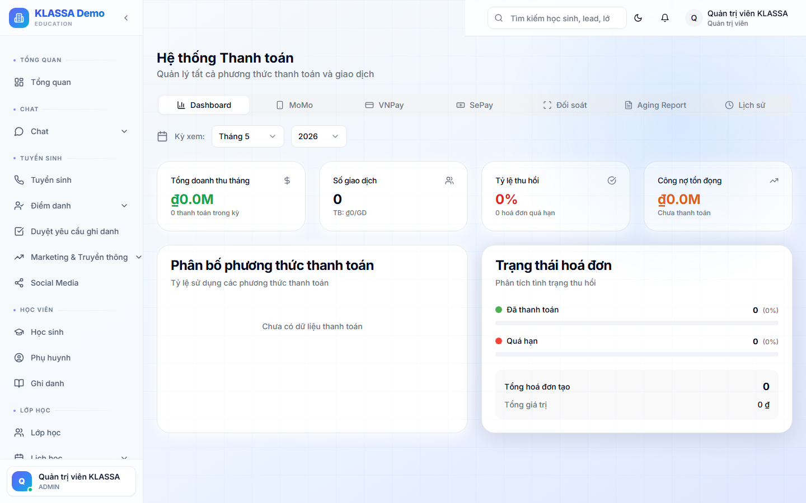

# Thu - chi (thanh toán)

## Khái niệm

**Thu** — tiền vào trung tâm (học phí, phụ thu, học liệu).
**Chi** — tiền ra (lương, thuê, điện nước, chi khác).

Mỗi giao dịch thu/chi đều được ghi nhận với:

- Ngày giao dịch
- Số tiền
- Kênh thanh toán (tiền mặt / chuyển khoản / thẻ)
- Liên kết với hoá đơn (đối với thu) hoặc danh mục chi
- Người tạo + người duyệt

## Truy cập

Menu trái → **Học phí & Hoá đơn → Thanh toán** (hoặc **/finance/payments**).

## Ghi nhận thu

### Khi phụ huynh đóng tiền

1. Mở hoá đơn cần thu
2. Bấm **"+ Ghi nhận thu"**
3. Điền:
   - Số tiền (mặc định = tổng hoá đơn, có thể nhỏ hơn nếu thanh toán một phần)
   - Kênh (tiền mặt / chuyển khoản / VNPay / Momo / VietQR)
   - Ngày thu (mặc định hôm nay)
   - Số phiếu thu (tự sinh, có thể đổi)
   - Ghi chú
4. Bấm **"Lưu + In phiếu thu"** — sinh phiếu PDF để in cho phụ huynh

### Đối soát chuyển khoản tự động (nếu kết nối ngân hàng)

Nếu trung tâm đã [kết nối ngân hàng](../tich-hop/ngan-hang.md):

- Khi phụ huynh chuyển khoản với nội dung đúng (vd `HD12345`), phần mềm tự đối soát và đánh dấu hoá đơn "Đã thanh toán"
- Không cần lễ tân ghi tay

## Ghi nhận chi

### Bước 1 — Vào tab "Chi"

### Bước 2 — Bấm "+ Tạo chi"

### Bước 3 — Điền

- **Danh mục** — Lương / Thuê / Điện nước / Tiếp khách / Marketing / Khác
- **Số tiền**
- **Người nhận** (tên người + SĐT hoặc TK)
- **Kênh chi**
- **File chứng từ** (hoá đơn, biên nhận, hợp đồng)
- **Người duyệt** (chọn từ danh sách Quản lý)

### Bước 4 — Gửi duyệt

Chi tiêu cần Quản lý duyệt trước khi trả tiền:

- **Chi nhỏ (<500k)** — tự duyệt nếu Kế toán có quyền
- **Chi lớn** — chờ Quản lý / Chủ trung tâm duyệt

## Sổ quỹ

Tab **"Sổ quỹ"** hiển thị:

- Tiền mặt tồn quỹ
- Số dư tài khoản ngân hàng
- Lịch sử mọi giao dịch theo ngày
- Đối soát đầu kỳ - cuối kỳ

## Đối soát hàng ngày / hàng tháng

Cuối ngày: kế toán đối soát:

- Tiền mặt thực có trong két = Tổng thu tiền mặt - Tổng chi tiền mặt + Tồn đầu ngày
- Số dư tài khoản ngân hàng = Số dư đầu kỳ + Thu CK - Chi CK

Nếu lệch → kiểm tra giao dịch trong ngày.

## Lưu ý

- **Mọi thay đổi** giao dịch đều ghi nhật ký, không xoá được sạch (chỉ "huỷ + ghi lý do").
- **Báo cáo doanh thu** lấy số liệu từ đây — nhập đúng để báo cáo chính xác.

## Câu hỏi thường gặp

**Phụ huynh đóng nhầm thừa, làm sao?**
Tạo phiếu chi loại "Hoàn tiền thừa" → trả lại phần dư. Hoặc bảo lưu cho kỳ sau (tạo phiếu thu bảo lưu).

**In phiếu thu/chi ra giấy, mẫu thế nào?**
Có 3 mẫu sẵn: chuẩn, đơn giản, có logo. Đổi mẫu trong **Cài đặt → Mẫu phiếu thu chi**.
