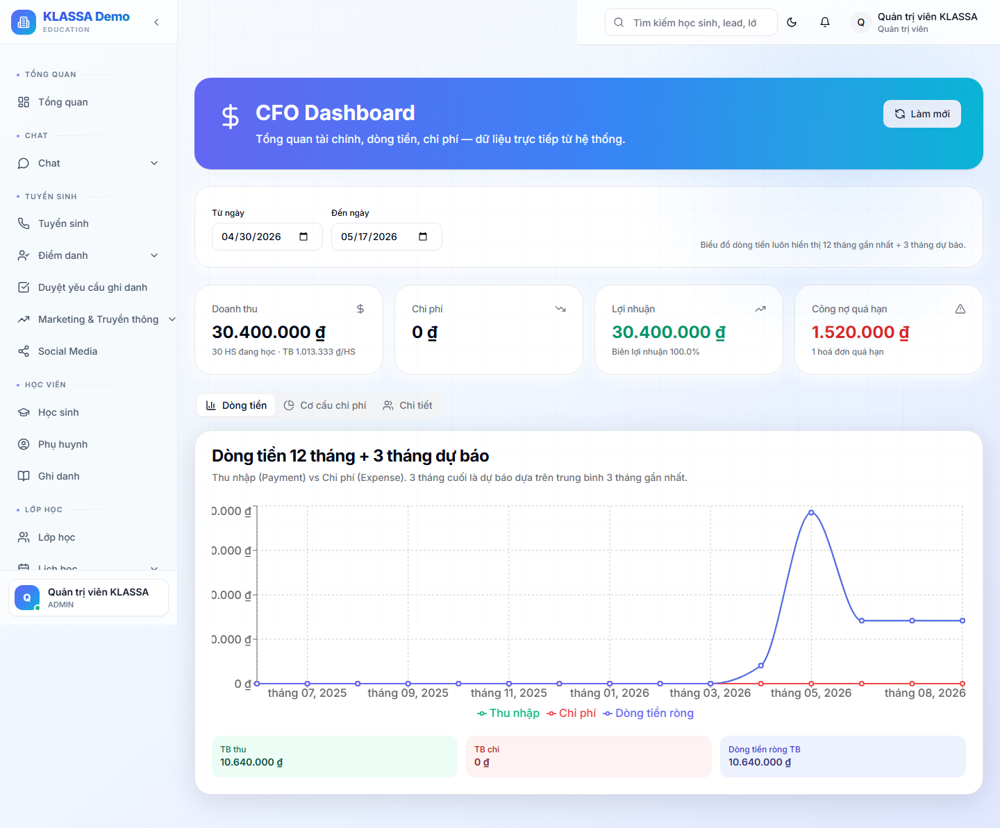

# Tổng quan tài chính

## Khi nào dùng

Bắt đầu mỗi ngày làm việc của Kế toán / Quản lý — nhìn nhanh tình hình thu - chi - công nợ.

## Truy cập

Menu trái → **Học phí & Hoá đơn → Tổng quan** (hoặc **/finance/overview**).

## Các khối số liệu

### 1. Doanh thu

- **Doanh thu tháng** (hiện tại)
- **So với tháng trước** — tăng / giảm bao nhiêu %
- **Mục tiêu tháng** — nếu trung tâm có đặt KPI

### 2. Công nợ

- **Tổng nợ phải thu** — học phí học sinh chưa đóng
- **Nợ quá hạn** — quá ngày đến hạn nhưng chưa thu
- **Số học sinh nợ**
- Bấm để mở [Báo cáo công nợ](../bao-cao/cong-no.md)

### 3. Chi phí

- **Tổng chi tháng** — lương + điện nước + thuê + khác
- **Lương chiếm bao nhiêu %** doanh thu
- **Lợi nhuận tạm tính** = Doanh thu - Chi phí

### 4. Hoá đơn

- **Hoá đơn đã tạo trong tháng**
- **Hoá đơn đã gửi** vs **Đã thanh toán**
- **Hoá đơn chờ duyệt** — cần Kế toán xem

## Biểu đồ

- **Doanh thu 12 tháng gần nhất** — xu hướng theo mùa
- **Phân loại doanh thu** — theo khoá học / cơ sở / loại học sinh

## Lưu ý

- **Số liệu cập nhật theo thời gian thực** — vừa nhận thanh toán đã thấy trong tổng quan.
- **Chỉ Kế toán + Quản lý** xem được trang này. Lễ tân không thấy doanh thu.

## Câu hỏi thường gặp

**Doanh thu hiển thị có tính đến hoàn tiền không?**
Có. Doanh thu thuần = Thu vào - Hoàn trả.

**Tôi muốn so sánh với cùng kỳ năm trước, có không?**
Có. Bộ lọc thời gian → chọn "So sánh với năm trước" → biểu đồ overlay 2 đường.
