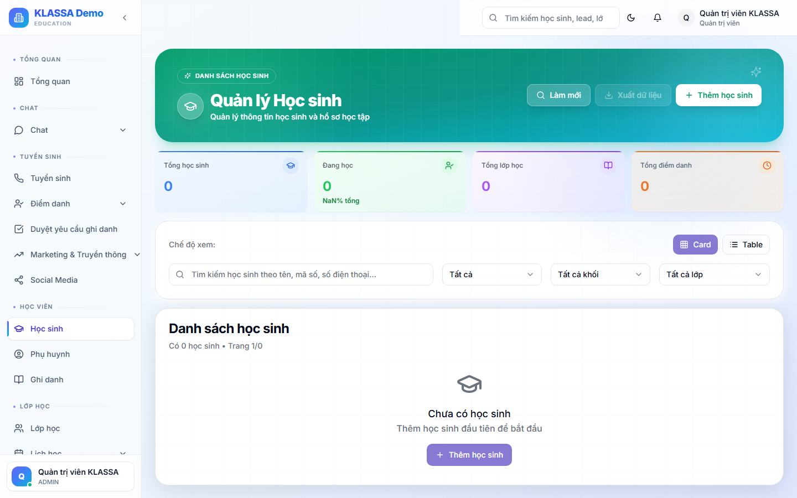

# Trang chi tiết học sinh

## Khi nào dùng

- Xem toàn bộ thông tin một học sinh
- Theo dõi tiến độ học, điểm số, điểm danh
- Tra cứu lịch sử hoá đơn
- Liên lạc phụ huynh

## Cách mở

Từ **Danh sách học sinh** → bấm vào dòng học sinh.

## Bố cục trang

### Phần đầu — Hero card

- Ảnh + Tên + Mã học sinh
- Khối lớp + Trạng thái
- 4 chỉ số nhanh: số buổi đã học, tỷ lệ chuyên cần, học phí còn nợ, điểm trung bình

### Các tab nội dung

#### Tab "Tổng quan"
- Thông tin cá nhân (ngày sinh, địa chỉ, trường)
- Phụ huynh liên hệ
- Lớp đang học
- Khoá đã đăng ký

#### Tab "Lớp & Ghi danh"
- Lịch sử các lớp đã học
- Lớp hiện tại
- Bấm **"+ Ghi danh thêm lớp"** để thêm lớp mới

#### Tab "Điểm danh"
- Bảng điểm danh chi tiết từng buổi
- Lọc theo lớp / theo tháng
- Số buổi nghỉ, đi muộn, học bù

#### Tab "Hoá đơn"
- Lịch sử hoá đơn (đã thanh toán + đang nợ)
- Tổng đã đóng / tổng phải đóng
- Bấm **"+ Tạo hoá đơn"** để thêm mới

#### Tab "Học tập"
- Điểm các bài đánh giá
- Nhận xét của giáo viên
- Tiến độ chương trình

#### Tab "Tin nhắn"
- Lịch sử chat với phụ huynh
- Nhật ký gọi điện
- Tin Zalo / email đã gửi

#### Tab "Tài liệu"
- File đính kèm (giấy khai sinh, ảnh thẻ, đơn xin học bổng…)

## Thao tác nhanh

Trên đầu trang có các nút:

- **✏️ Sửa** — cập nhật thông tin
- **💬 Nhắn Zalo phụ huynh**
- **☎️ Gọi phụ huynh**
- **📄 Tạo hoá đơn**
- **🔄 Đổi trạng thái** — Tạm nghỉ / Đã nghỉ / Hoàn thành

## Lưu ý

- **Thông tin được cập nhật ngay** — vừa chấm điểm danh thì tab Điểm danh hiển thị luôn.
- **Phụ huynh xem trang riêng** trong Cổng Phụ huynh, không phải trang này.

## Câu hỏi thường gặp

**Học sinh có 2 phụ huynh đăng nhập riêng, làm sao quản lý?**
Trong tab "Tổng quan" → mục Phụ huynh → bấm "+ Thêm phụ huynh" → mỗi phụ huynh có tài khoản riêng nhưng cùng xem được con.

**Đổi học sinh sang khoá khác, xử lý thế nào?**
Tab "Lớp & Ghi danh" → kết thúc lớp hiện tại (bấm "Hoàn thành") → bấm "+ Ghi danh thêm lớp" với khoá mới.
