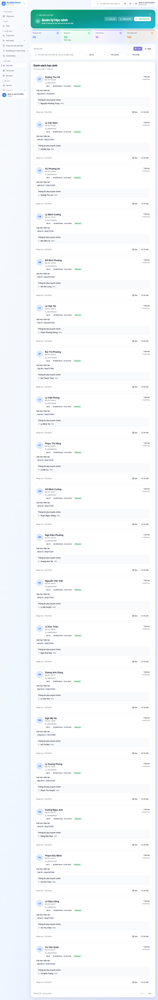

# Danh sách học sinh

## Khi nào dùng

- Tra cứu thông tin một học sinh cụ thể
- Xem ai đang học, ai đã nghỉ, ai sắp hết hạn học phí
- Xuất danh sách báo cáo theo cơ sở / lớp / khoá
- Lọc học sinh sinh nhật tháng này để gửi lời chúc

## Truy cập

Menu trái → **Học sinh**.

## Bố cục trang

### Khối số liệu

- **Tổng học sinh đang học**
- **Học sinh mới tháng này**
- **Sắp hết hạn học phí** (trong 7 ngày tới)
- **Đã nghỉ tháng này** (cần chăm sóc lại)

### Bộ lọc

- **Trạng thái** — Đang học / Tạm nghỉ / Đã nghỉ / Hoàn thành khoá
- **Khoá / Lớp** — chỉ xem học sinh của một lớp
- **Cơ sở** — nếu trung tâm có nhiều chi nhánh
- **Khối lớp** — Lớp 6, 7, 8…
- **Sinh nhật tháng** — phục vụ marketing
- **Tìm kiếm** — gõ tên, mã, SĐT phụ huynh

### Bảng danh sách

Mỗi dòng có:

- Mã học sinh
- Họ tên + ảnh
- Khối lớp
- Lớp đang học
- Phụ huynh + SĐT
- Trạng thái
- Hạn học phí gần nhất

Bấm vào dòng để mở [chi tiết học sinh](chi-tiet.md).

## Thao tác nhanh

- **Xuất Excel** — danh sách lọc hiện tại
- **Gửi tin Zalo hàng loạt** — chọn nhiều học sinh → gửi cùng nội dung cho phụ huynh
- **Gắn thẻ** — đánh dấu nhóm học sinh để lọc lại sau (VIP, Học bổng, Cần chú ý…)

## Lưu ý

- **Học sinh đã nghỉ** vẫn còn trong hệ thống, không xoá — phục vụ lịch sử và báo cáo.
- **Mã học sinh** mặc định tự sinh, có thể tuỳ chỉnh format trong Cài đặt.

## Câu hỏi thường gặp

**Tôi muốn xem học sinh đã nghỉ, hiển thị thế nào?**
Bộ lọc trạng thái → chọn "Đã nghỉ". Mặc định chỉ hiện học sinh đang học.

**Tại sao có học sinh không thấy SĐT phụ huynh?**
Có thể nhập sót khi tạo hồ sơ. Bấm vào học sinh → tab Phụ huynh → bổ sung.
