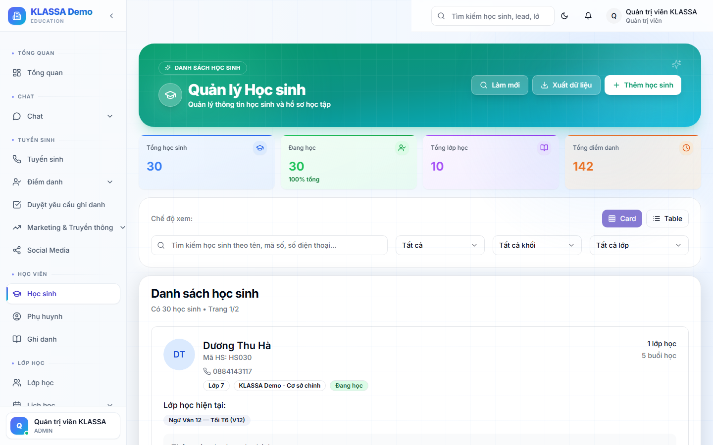

# Học sinh nghỉ học — xử lý thế nào

## Phân biệt 3 trạng thái

| Trạng thái | Ý nghĩa | Khi nào dùng |
|------------|---------|---------------|
| **Tạm nghỉ** | Học sinh đang dừng học tạm thời | Nghỉ hè, ốm dài ngày, bận thi… nhưng sẽ quay lại |
| **Đã nghỉ** | Học sinh đã thôi học hẳn | Chuyển nhà, đổi trung tâm, không muốn học tiếp |
| **Hoàn thành** | Học sinh đã học xong khoá | Tốt nghiệp khoá, không học khoá mới |

## Khi nào dùng

Đổi trạng thái thay vì xoá hồ sơ — để **giữ lịch sử** điểm danh, hoá đơn, kết quả học tập.

## Các bước

### Cách 1 — Từ trang chi tiết học sinh

1. Mở **chi tiết học sinh** cần đổi trạng thái
2. Bấm **"🔄 Đổi trạng thái"** ở góc phải trên
3. Chọn trạng thái mới
4. Điền **lý do** (bắt buộc — phục vụ báo cáo)
5. Chọn **ngày hiệu lực** (mặc định hôm nay)

### Cách 2 — Hàng loạt từ danh sách

Trang **Danh sách học sinh** → tick chọn nhiều học sinh → bấm **"Thao tác hàng loạt → Đổi trạng thái"**.

## Việc tự động xảy ra khi đổi trạng thái

### Khi chuyển sang "Tạm nghỉ"

- Học sinh KHÔNG bị xoá khỏi lớp
- Lịch dạy vẫn hiển thị, nhưng không tính buổi nghỉ vào số buổi đã học
- Hoá đơn cũ vẫn còn, không tự huỷ

### Khi chuyển sang "Đã nghỉ"

- Tự động **kết thúc ghi danh** vào lớp (không xoá lịch sử)
- Học sinh không xuất hiện trong danh sách điểm danh buổi tới
- Hệ thống tính tổng học phí đã đóng vs đã sử dụng → có thể **hoàn tiền** phần dư
- Phụ huynh được thông báo (nếu trung tâm bật)

### Khi chuyển sang "Hoàn thành"

- Lưu hồ sơ + kết quả học tập
- Học sinh được đưa vào danh sách **"Cựu học viên"**
- Có thể tái ghi danh sau (đăng ký khoá mới)

## Lưu ý

- **Hoàn tiền học phí dư**: nếu đã đóng 6 tháng, học được 3 tháng → phần mềm tính phần dư, tạo phiếu hoàn tiền. Kế toán chi trả theo phiếu này.
- **Không xoá học sinh đã nghỉ**: lưu để báo cáo cuối năm.
- **Liên hệ lại học sinh đã nghỉ**: trong báo cáo có chỉ số "Tỷ lệ retention" — quan trọng để cải thiện dịch vụ.

## Câu hỏi thường gặp

**Học sinh chuyển sang trung tâm khác, có khôi phục lại được không?**
Có. Đổi trạng thái về "Đang học" — mọi thông tin cũ vẫn còn.

**Học sinh nghỉ giữa khoá, học phí thừa xử lý sao?**
Hai cách:
1. **Hoàn tiền** — tính số buổi chưa học × đơn giá buổi → trả lại phụ huynh
2. **Bảo lưu** — giữ lại tiền cho khoá sau (phổ biến hơn)

Chọn cách trong popup đổi trạng thái.
