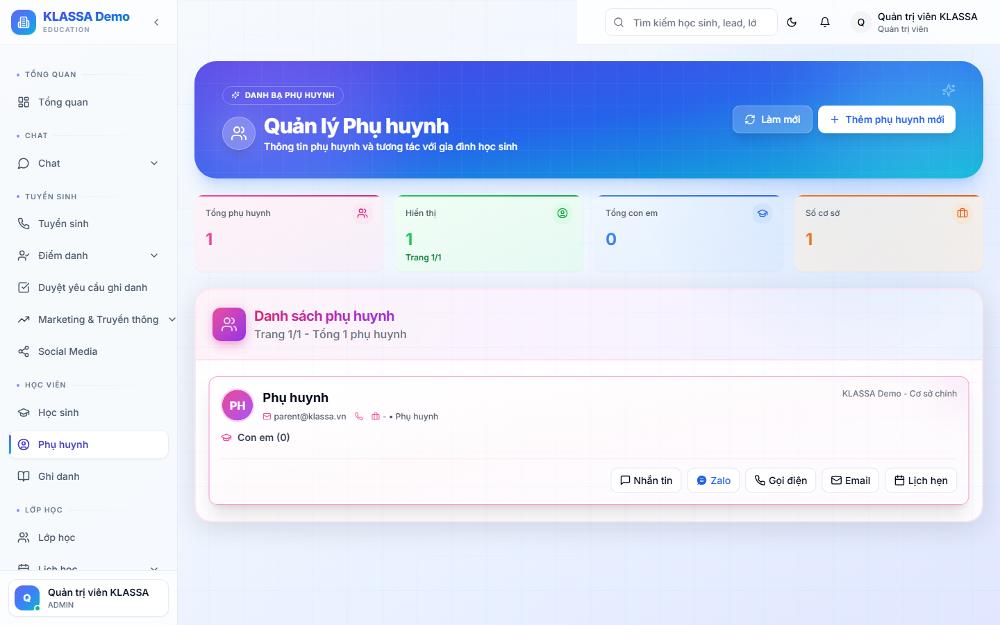

# Quản lý phụ huynh

## Khái niệm

**Phụ huynh** là một loại người dùng đặc biệt trong KLASSA:

- Có **hồ sơ** lưu trong hệ thống (như học sinh)
- Có **tài khoản đăng nhập** vào Cổng Phụ huynh
- Có thể **liên kết với nhiều học sinh** (1 phụ huynh quản lý 2-3 con cùng học)

## Khi nào dùng

- Tra cứu thông tin phụ huynh để gọi điện
- Cập nhật SĐT phụ huynh khi đổi số
- Gắn nhiều con vào cùng một phụ huynh
- Đặt lại mật khẩu cho phụ huynh quên tài khoản

## Truy cập

Menu trái → **Phụ huynh** (hoặc từ trang chi tiết học sinh → tab Phụ huynh → Xem hồ sơ).

## Thông tin trên hồ sơ phụ huynh

- Họ tên, SĐT, email
- Mối quan hệ với học sinh (bố / mẹ / ông / bà / khác)
- Nghề nghiệp (tuỳ chọn)
- Địa chỉ
- Danh sách con đang học trong trung tâm

## Tài khoản đăng nhập

Mỗi phụ huynh có 1 tài khoản dùng để vào **Cổng Phụ huynh** xem điểm danh, hoá đơn của con.

- **Email đăng nhập** = email trên hồ sơ. Nếu không có email, dùng SĐT.
- **Mật khẩu khởi tạo** mặc định là `12345678` — phụ huynh nên đổi sau lần đầu.
- **Đặt lại mật khẩu**: bấm nút "🔑 Đặt lại mật khẩu" trên trang chi tiết phụ huynh → mật khẩu về `12345678` để phụ huynh đăng nhập lại.

## Thao tác

### Gắn thêm con vào phụ huynh

Trang chi tiết phụ huynh → tab "Học sinh" → bấm **"+ Thêm học sinh"** → chọn học sinh có sẵn hoặc tạo mới.

### Tách phụ huynh khỏi học sinh

Tab "Học sinh" → bấm dấu **❌** cạnh tên học sinh muốn tách.

### Xoá phụ huynh

Chỉ Quản lý trở lên xoá được. Phải tách hết học sinh trước khi xoá.

## Lưu ý

- **Không tạo trùng phụ huynh**: nếu gia đình có 2 con, dùng 1 hồ sơ phụ huynh cho cả 2 — không tạo 2 hồ sơ riêng.
- **Phụ huynh có thể tự cập nhật thông tin** từ Cổng Phụ huynh — đỡ việc cho lễ tân.

## Câu hỏi thường gặp

**Bố và mẹ đều muốn xem thông tin con, làm sao?**
Tạo 2 hồ sơ phụ huynh (1 bố + 1 mẹ), cả 2 đều gắn vào học sinh. Mỗi người đăng nhập tài khoản riêng.

**Phụ huynh không có email, vẫn cấp tài khoản được không?**
Được. Dùng SĐT làm tên đăng nhập, mật khẩu mặc định `12345678`.
