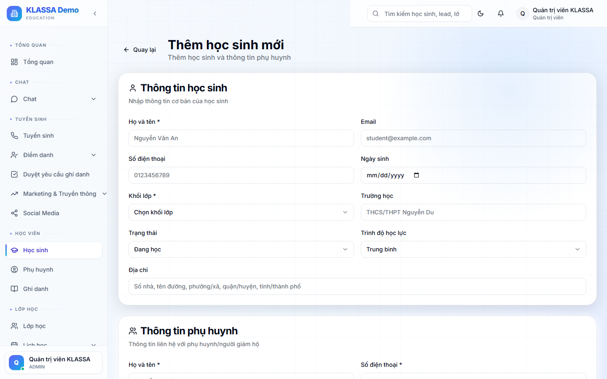

# Tạo hồ sơ học sinh mới

## Khi nào dùng

- Học sinh chính thức đăng ký (đã đóng học phí hoặc cam kết)
- Học sinh được chuyển từ Lead — xem [Chuyển Lead thành Học sinh](../tuyen-sinh/chuyen-lead-thanh-hoc-sinh.md)
- Nhập danh sách học sinh cũ vào hệ thống (khi mới triển khai phần mềm)

## Cách 1 — Tạo thủ công

### Bước 1 — Mở form

Trang **Học sinh** → bấm **"+ Thêm học sinh"** ở góc phải.

### Bước 2 — Điền thông tin học sinh

**Bắt buộc:**
- Họ tên
- Ngày sinh
- Giới tính

**Khuyến nghị:**
- Khối lớp đang học (Lớp 6, 7, 8…)
- Trường học hiện tại
- Địa chỉ
- Ảnh chân dung

### Bước 3 — Thông tin phụ huynh

Trong form có phần **"Phụ huynh"**:

- **Nếu phụ huynh chưa có** trong hệ thống: điền họ tên + SĐT + mối quan hệ → tự tạo hồ sơ phụ huynh và tài khoản đăng nhập.
- **Nếu phụ huynh đã có** (đang có con khác học): gõ SĐT → phần mềm tự gợi ý → chọn để gắn vào.

Có thể thêm nhiều phụ huynh (bố + mẹ + ông bà) — phần mềm cho phép.

### Bước 4 — Ghi danh vào lớp (tuỳ chọn)

Bên dưới có phần **"Ghi danh"**:

- Chọn khoá học
- Chọn lớp cụ thể
- Ngày bắt đầu
- Bỏ qua nếu chưa rõ lớp

### Bước 5 — Lưu

Bấm **"Lưu"**. Hệ thống tạo đồng thời:

- Hồ sơ học sinh
- Hồ sơ phụ huynh (nếu mới)
- Tài khoản phụ huynh
- Ghi danh vào lớp (nếu có chọn)

## Cách 2 — Nhập từ Excel

Phù hợp khi nhập danh sách lớn (chuyển từ phần mềm cũ sang, hoặc đầu năm học mới).

- Tải file mẫu Excel từ **Học sinh → Nhập Excel**
- Điền theo cột có sẵn (không đổi tên cột)
- Tải lên → phần mềm kiểm tra trùng SĐT → bấm "Xác nhận"

## Lưu ý

- **Trùng tên** không sao — phần mềm phân biệt bằng mã học sinh.
- **Phụ huynh dùng chung 1 SĐT** cho 2 con: hệ thống tự nhận diện và gộp.
- **Không tạo lại học sinh** nếu chỉ chuyển sang khoá khác — sửa hồ sơ cũ.

## Câu hỏi thường gặp

**Học sinh không có phụ huynh đi cùng (đã đủ tuổi tự đăng ký), làm sao?**
Bỏ trống phần phụ huynh, hệ thống vẫn lưu. Có thể bổ sung sau.

**Ảnh học sinh nên dùng ảnh nào?**
Ảnh thẻ chân dung 4×6 rõ mặt. Phục vụ điểm danh nhận diện và in thẻ học sinh.
